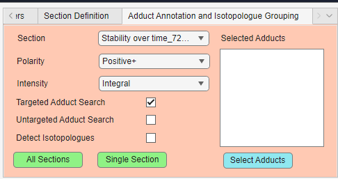

# Adduct annotation and isotopologue grouping

The **Adduct Annotation and Isotopologue Grouping** panel is used to search for related adduct forms and isotopologue patterns in the loaded experiment.

{ width="550px" }

This panel can be used for both targeted and untargeted workflows. Targeted workflows use the current m/z list as input, while untargeted workflows can use detected features and adduct hypotheses to find possible relationships between ions.

## Parameter overview

| Parameter | Description |
|---|---|
| Section | Selects which section should be processed when running a single-section search |
| Polarity | Selects positive or negative ion mode.  |
| Intensity | Selects how scan-level intensities should be summarized |
| Targeted Adduct Search | Searches for expected adducts based on the current m/z list |
| Untargeted Adduct Search | Runs untargeted adduct annotation using findMAIN/InterpretMSSpectrum |
| Detect Isotopologues | Enables isotopologue grouping or targeted isotope evidence search |
| Selected Adducts | Shows the adducts currently selected for adduct search |
| Select Adducts | Opens the adduct selection dialog |
| All Sections | Runs the selected workflow for all available sections |
| Single Section | Runs the selected workflow only for the selected section |

## Section

The **Section** dropdown selects which section should be processed when using **Single Section**.

For sequential experiments, a section usually corresponds to one file. For continuous experiments, a section corresponds to a detected scan interval inside a source file.

Use **Single Section** when testing settings or inspecting one sample before running the workflow on the full experiment.

## Polarity

The **Polarity** dropdown controls which ion mode is used for adduct handling. 

Options are:

| Polarity | Description |
|---|---|
| Positive+ | Positive ion mode adducts, such as `[M+H]+`, `[M+Na]+`, `[M+K]+`, or `[M+NH4]+` |
| Negative- | Negative ion mode adducts, such as `[M-H]-` or `[M+Cl]-` |

The selected polarity affects which adducts are selectable after pressing the *Select Adducts* button.

## Intensity

The **Intensity** dropdown controls how scan-level evidence is summarized into section-level intensity values.

Options include:

| Intensity mode | Description |
|---|---|
| Integral | Sums intensities across scans |
| Average including zeros | Calculates the mean including zero values |
| Average excluding zeros | Calculates the mean after ignoring zero values |
| Median | Calculates the median across scans |

For adduct and isotopologue evidence, **Integral** is often useful because it represents the total signal observed across the selected section.

## Selected adducts

The **Selected Adducts** list shows which adducts are currently included in the adduct search. Press the *Select Adducts* button to choose which adducts to look for.

The available options are the following:

Positive mode:

| Adduct | Meaning |
|---|---|
| `[M+H]+` | Protonated molecule |
| `[M+Na]+` | Sodium adduct |
| `[M+K]+` | Potassium adduct |
| `[M+NH4]+` | Ammonium adduct |
| `[M+H-H2O]+` | Water-loss protonated ion |
| `[M+¹⁰⁷Ag]+` | Silver-107 adduct |
| `[M+¹⁰⁹Ag]+` | Silver-109 adduct |

Negative mode:

| Adduct | Meaning |
|---|---|
| `[M-H]-` | Deprotonated molecule |
| `[M+Cl]-` | Chloride adduct |
| `[M-H-H2O]-` | Water-loss deprotonated ion |
| `[M+HCOOH-H]-` | Formate adduct |

Use **Select Adducts** to add or remove adducts before running the search.

## Targeted adduct search

**Targeted Adduct Search** uses the current m/z list as the starting point.

For each target m/z, DIP_IT:

1. Interprets the target as a base ion.
2. Calculates the corresponding neutral mass.
3. Calculates the expected m/z values for the selected adducts.
4. Searches the raw/section data for matching peaks within the selected ppm tolerance.
5. Exports an evidence table with expected m/z, observed m/z, ppm error, probable adduct, and section intensities.

This is useful when you already have a target list and want to check whether related adducts are present in the data. If the m/z target list is annotated with an adduct suffix, DIP_IT can infer the base adduct automatically, which is explained more in the next section.

## Base adduct inference

If the annotation contains an adduct suffix, DIP_IT can infer the base adduct automatically.

Examples:

| Annotation ending | Interpreted as |
|---|---|
| `+H` | `[M+H]+` |
| `+Na` | `[M+Na]+` |
| `+K` | `[M+K]+` |
| `+NH4` | `[M+NH4]+` |
| `[M-H]-` | `[M-H]-` |
| `[M-H2O-H]-` | `[M-H-H2O]-` |
| `[M+Cl]-` | `[M+Cl]-` |

For example, if a target is annotated as `Glycerol [M-H2O-H]-`, DIP_IT treats the input m/z as a water-loss negative ion, calculates the neutral mass, and then searches for the other selected adduct forms.

## Untargeted adduct search

**Untargeted Adduct Search** runs adduct annotation without requiring a predefined target list.

This workflow uses findMAIN/InterpretMSSpectrum ([Article](https://pubmed.ncbi.nlm.nih.gov/28499062/) and [R package](https://cran.r-project.org/web/packages/InterpretMSSpectrum/index.html)) to search for possible adduct relationships in the observed spectrum. It is useful when the goal is to discover possible adduct groups or neutral masses from the measured features.

Untargeted adduct search is more exploratory than targeted adduct search. It can suggest possible adduct relationships, but results should be inspected carefully and validated where possible.

The untargeted adduct search exports an evidence table containing the neutral mass, observed m/z, the probable adduct, and the intensity of the adduct for each section. 

!!! note
    Untargeted adduct search requires the R package `InterpretMSSpectrum` to be installed and available. See the installation documentation for details.

!!! info
    The resulting adduct hypothesis for a section is derived from a combination of findMain's own scoring method with the adduct detection frequency count in a section. 
    
    In detail, findMain is run on each scan in a section, and outputs a probability score for each probable adduct in a scan. The median score across scans is then multiplied by the detection frequency, and the adduct hypothesis with the highest score is selected as the probable adduct. 
    
    For example, the median score may be 0.5 for an adduct across the scans in a section, and it may be detected across 17/20 scans. Thus, the score becomes 0.5*17 = 8.5 for that adduct. The adduct with the highest score becomes the candidate adduct. 

## Isotopologue detection

**Detect Isotopologues** enables carbon isotopologue grouping or carbon isotope evidence detection.

Carbon isotopologues are related peaks caused by the natural abundance of Carbon-13. These peaks occur at predictable m/z differences from the monoisotopic feature. More specifically, they occur at

$$
m/z = M + N × 1.00335
$$
where N is the number of incorporated Carbon-13 atoms.

In targeted mode, DIP_IT uses the current m/z list and searches the scan data for isotope peaks related to each target m/z. DIP_IT searches for isotopologue peaks up to M+6.

For each target m/z, DIP_IT can search for:

| Label | Meaning |
|---|---|
| M+0 | Base or monoisotopic peak |
| M+1 | First isotope peak |
| M+2 | Second isotope peak |
| M+3 | Third isotope peak |
| M+n | Higher isotope peaks, up to M+6 |

The output includes a .CSV of expected m/z, observed m/z, ppm error, and intensity values across sections, grouped together by their monoisotopic m/z.

## All sections

The **All Sections** button runs the selected workflow across all loaded sections.

For all-section exports, DIP_IT creates section-wise intensity columns so that each sample or section appears as a separate column in the output table.

## Single section

The **Single Section** button runs the selected workflow only on the section selected in the **Section** dropdown.

!!! note
    If you select to do both isotopologue grouping and adduct detection, they will automatically run one after another. Both options require you to select where to save the output .CSV file(s).

## Choosing between targeted and untargeted adduct search

Use **Targeted Adduct Search** when:

- you already have a target m/z list
- you want to check specific expected adducts
- you want evidence directly from the raw/section data
- you want a controlled and interpretable output table

Use **Untargeted Adduct Search** when:

- you do not have a target list
- you want to discover possible adduct relationships
- you want findMAIN to suggest adduct hypotheses
- you are exploring unknown features

!!! tip
    The adduct search supports TIC, Targeted Tic, Internal Standard and QC Drift normalization, if they are selected in the feature processing panel. 

