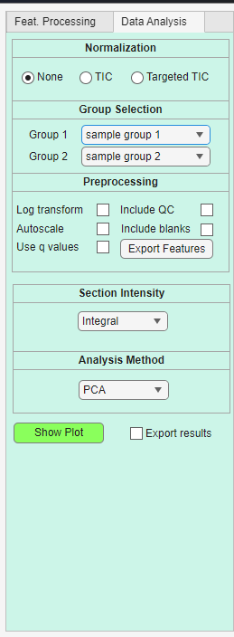
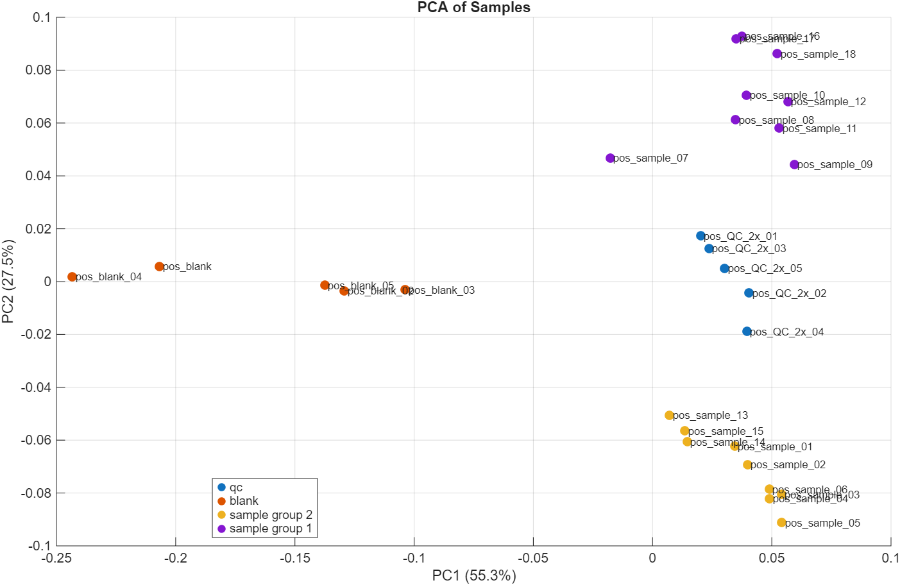
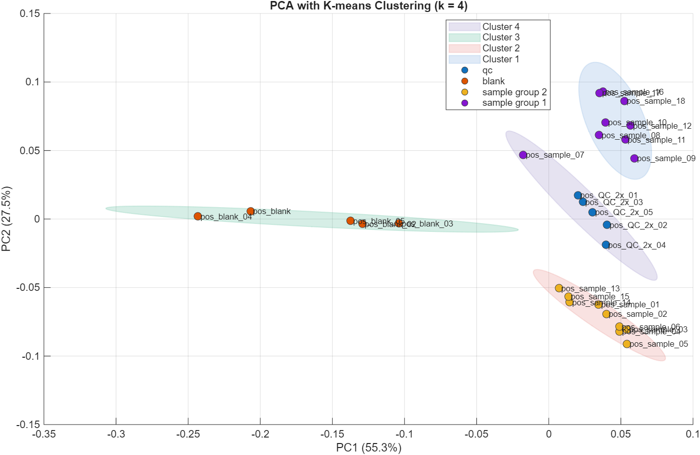
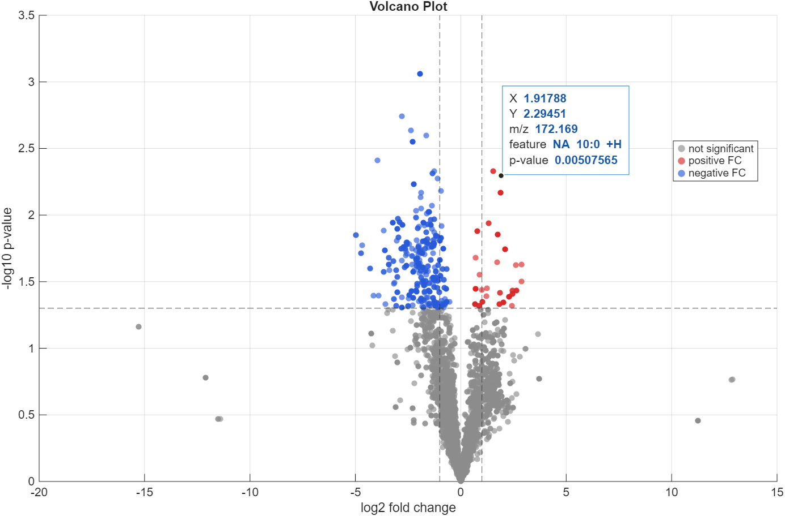
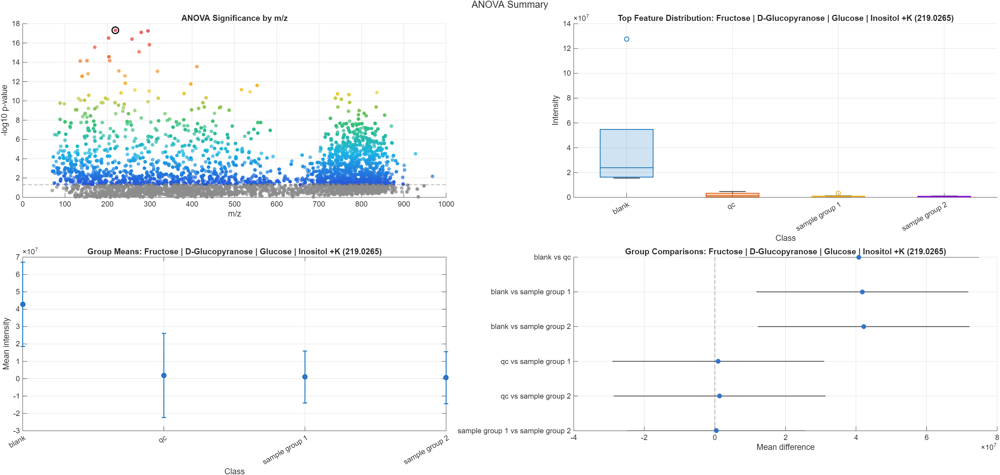
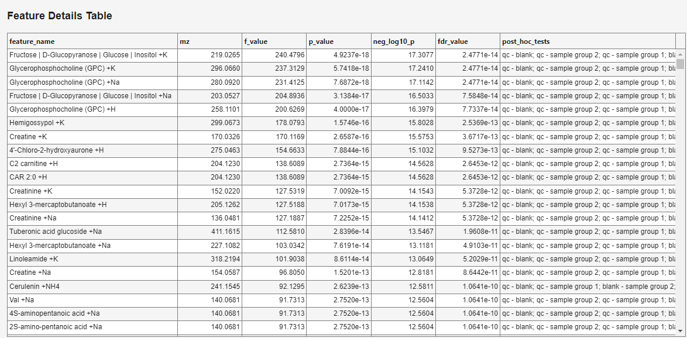
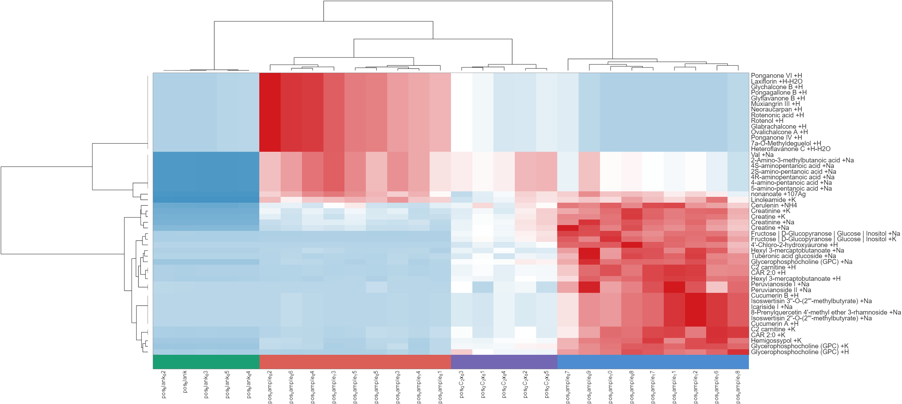
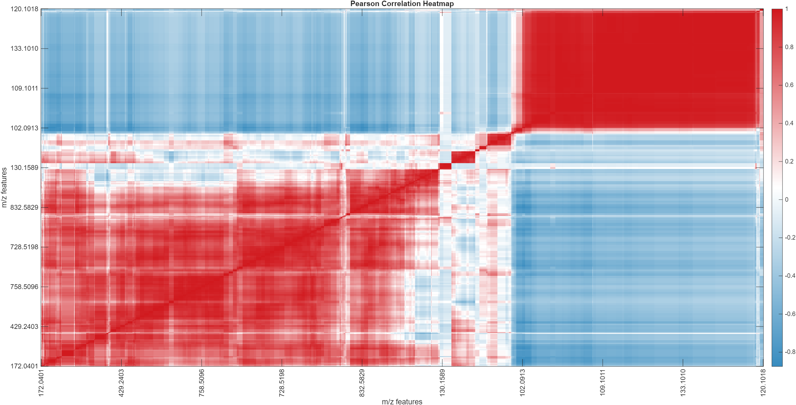
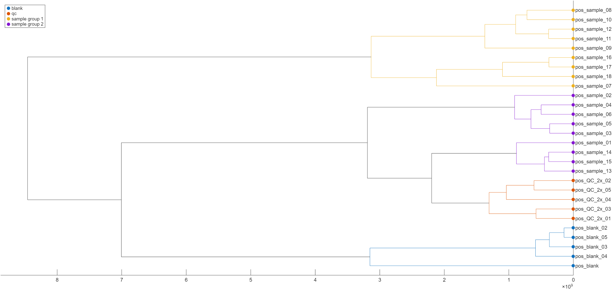

# Data analysis tab

The **Data Analysis** tab provides built-in tools for exploring the processed feature table directly inside DIP_IT.

{ width="300px" }

The analysis tools use the currently loaded experiment, the current m/z feature list, and section class information from the log file. The data analysis takes in consideration any filters applied in the Feature Processing tab, and uses filtered features for analysis. 

## Parameter overview

| Section | Purpose |
|---|---|
| Normalization | Selects whether intensities are normalized before analysis |
| Group Selection | Selects groups used for two-group methods such as t-tests and volcano plots |
| Preprocessing | Applies transformations such as log transform or autoscaling |
| Section Intensity | Selects how scan-level intensity values are summarized |
| Analysis Method | Selects the statistical or visualization method |
| Show Plot | Runs the selected analysis and displays the result |
| Export results | Saves the result table from the analysis |

## Normalization

The **Normalization** section controls whether feature intensities are normalized before data analysis.

| Option | Description |
|---|---|
| None | Uses the summarized intensities directly |
| TIC | Normalizes intensities by total ion current |
| Targeted TIC | Normalizes intensities by the total signal of the targeted feature set |

Use **None** when you want to inspect the processed intensities without additional scaling.

Use **TIC** or **Targeted TIC** when you want to reduce differences caused by total signal variation between samples or sections.

## Group selection

The **Group 1** and **Group 2** dropdowns select which sample classes should be compared.

These groups are used for two-group analyses such as:

- Anova
- Volcano Plot

The available group names come from the `class` column in the log file.

For example, if the log file contains classes named `control` and `treated`, these can be selected as Group 1 and Group 2.

!!! note
    PCA, heatmap, correlation heatmap, dendrogram, and ANOVA can use more than two groups. The group selectors are mainly important for two-group methods.

## Preprocessing

The **Preprocessing** section controls transformations applied before analysis.

| Option | Description |
|---|---|
| Log transform | Applies a log transformation to reduce the effect of very large intensities |
| Autoscale | Centers and scales each feature so features contribute more equally |
| Use q values | Uses FDR-adjusted q-values instead of raw p-values where relevant |
| Include QC | Includes QC samples in the analysis |
| Include blanks | Includes blank samples in the analysis |

## Log transform

The **Log transform** option applies a logarithmic transformation before analysis.

This is useful when intensity values span several orders of magnitude. Log transformation reduces the dominance of very high-intensity features and can make group differences easier to visualize.

Log transformation is commonly used before PCA, heatmaps, t-tests, volcano plots, and ANOVA.

## Autoscale

The **Autoscale** option centers and scales each feature.

Autoscaling makes each feature contribute more equally, regardless of its absolute intensity. This can be useful for PCA and some statistical comparisons when low-intensity but biologically relevant features should not be dominated by very high-intensity features.

Autoscaling changes the interpretation of the values. After autoscaling, the plot emphasizes relative patterns rather than raw abundance.

!!! note
    Autoscaling is only applied to PCA and when exporting the features. Autoscaling will not be performed if volcano plot, ANOVA or heatmaps has been selected as the method. 

## Use q values

The **Use q values** option uses false-discovery-rate-adjusted q-values instead of raw p-values in relevant statistical plots.

This is useful when many features are tested at the same time, because multiple testing increases the chance of false positives.

When enabled, significance in volcano plots and ANOVA summaries is based on q-values rather than unadjusted p-values.

## Include QC and blanks

The **Include QC** and **Include blanks** checkboxes control whether QC and blank entries are included in data analysis.

By default, many analyses are most interpretable when using sample groups only. However, including QC and blank samples can be useful for checking whether samples, QC, and blanks separate as expected.

Use **Include QC** when you want to inspect QC clustering or reproducibility.

Use **Include blanks** when you want to see how blank samples relate to biological or experimental samples.

## Export features

The **Export Features** button can be used to export the feature table used for analysis.

This is useful when you want to inspect the exact matrix behind the plot or use the processed data in another program.

## Section intensity

The **Section Intensity** dropdown selects how scan-level intensities are summarized before analysis.

Common options include:

| Option | Description |
|---|---|
| Integral | Sums intensities across scans |
| Average including zeros | Calculates average intensity including zero values |
| Average excluding zeros | Calculates average intensity after ignoring zero values |
| Median | Calculates median intensity across scans |

The selected intensity summary can affect PCA, heatmaps, t-tests, volcano plots, and ANOVA. Use the same summary mode as the export if you want the plot to match the exported table.

## Analysis method

The **Analysis Method** dropdown selects which analysis to run.

Available methods can include:

| Method | Description |
|---|---|
| PCA | Principal component analysis of samples |
| PCA with K-means clustering | PCA plot with sample clusters |
| t-test | Two-group statistical comparison for each feature |
| Volcano Plot | Fold-change and significance plot for two groups |
| ANOVA | Multi-group statistical comparison for each feature |
| Heatmap | Clustered heatmap of selected features and samples |
| Correlation Heatmap | Pearson correlation heatmap between features |
| Dendrogram | Hierarchical clustering of samples |

## PCA

/// caption
PCA showing clear distinction between sample groups, blanks and QC.
///
PCA shows the main directions of variation in the data.

Each point represents a sample or section. Samples that appear close together have similar feature intensity profiles, while samples far apart are more different.

The percentage shown on each axis indicates how much of the total variance is explained by that principal component.

PCA is useful for:

- checking sample grouping
- detecting outliers
- inspecting QC clustering
- comparing blanks and samples
- evaluating the effect of filtering and normalization

## PCA with K-means clustering

/// caption
PCA with k = 4 clusters. 
///

PCA with K-means clustering adds cluster assignments to the PCA plot.

The user selects the number of clusters, and DIP_IT groups samples based on their PCA scores.

This can help identify structure in the dataset, but clusters should be interpreted carefully and checked against the experimental design.

## Volcano plot

The volcano plot combines fold change and statistical significance.

Each point represents one feature.

| Axis | Meaning |
|---|---|
| x-axis | log2 fold change between the selected groups |
| y-axis | statistical significance, usually `-log10(p)` or `-log10(q)` |

Features far to the left or right have larger group differences. Features higher on the plot have stronger statistical evidence.

If q-values are enabled, the plot uses FDR-adjusted significance.

## ANOVA

ANOVA tests whether a feature differs between multiple sample classes.

Unlike a t-test, ANOVA can compare more than two groups at once.

When ANOVA is selected, DIP_IT opens an **ANOVA Summary** figure with four linked plots.

{ width="1500px" }

### ANOVA significance by m/z

The first plot shows statistical significance for each feature as a function of m/z.

Each point represents one feature. The x-axis is the feature m/z and the y-axis is the statistical significance, shown as `-log10(p)` or `-log10(q)` depending on whether q-values are enabled.

Features higher on the plot have stronger statistical evidence for differences between classes.

The horizontal dashed line indicates the significance threshold. Features below the threshold are shown in grey. Features above the threshold are colored by significance, where stronger significance is shown with warmer colors.

Clicking a feature in this plot selects it and updates the other ANOVA plots.

### Top feature distribution

The second plot shows the distribution of the selected feature across all classes.

This plot uses a box plot for each class. It helps show whether the selected feature is mainly high in one class, low in another class, or variable across several groups.

Use this plot to check whether the ANOVA result is driven by a real group difference or by a small number of outlier samples.

### Group means

The third plot shows the mean intensity of the selected feature in each class.

Error bars show the uncertainty around the group mean. This plot is useful for quickly seeing which classes have higher or lower average signal for the selected feature.

### Group comparisons

The fourth plot shows pairwise group comparisons for the selected feature.

Each row compares two classes. The point shows the estimated mean difference between the groups, and the horizontal line shows the confidence interval for that difference.

If the confidence interval crosses zero, the difference between those two groups is less clear. If the interval is far from zero, the selected feature differs more strongly between the two groups.

### ANOVA feature details table

DIP_IT also opens a **Feature Details Table** for the ANOVA results.

{ width="900px" }

The table lists the features ranked by ANOVA result.

| Column | Description |
|---|---|
| `feature_name` | Feature annotation or name |
| `mz` | Feature m/z value |
| `f_value` | ANOVA F-statistic |
| `p_value` | Raw ANOVA p-value |
| `neg_log10_p` | `-log10(p)` value used for significance plotting |
| `fdr_value` | FDR-adjusted q-value |
| `post_hoc_tests` | Pairwise group comparisons that pass the selected threshold |

ANOVA is useful when the experiment contains several groups and you want to identify features that differ between at least one of them.

Use the figure and table together. The table helps identify important features, while the four-panel plot helps interpret how each selected feature behaves across classes.

## Heatmap

The heatmap visualizes feature intensity patterns across samples.

Rows represent features and columns represent samples or sections. Colors represent relative or processed intensity values.

Hierarchical clustering can group samples and features with similar patterns.

When **Heatmap** is selected and **Show Plot** is pressed, DIP_IT first asks how features should be selected for the heatmap.

{ width="1000px" }
/// caption
Heatmap showing the top 50 t-test/ANOVA features in this dataset.
///

The available options are:

| Option | Description |
|---|---|
| Top by intensity | Selects the features with the highest overall intensity |
| Top by t-test / ANOVA | Selects features with the strongest statistical differences between groups |
| Cancel | Cancels heatmap creation |

After choosing the selection method, DIP_IT asks how many features should be included.

The default value is `50`. A smaller number produces a simpler and more readable heatmap. A larger number includes more features, but the plot can become crowded.

### Top by intensity

**Top by intensity** selects features based on their overall abundance.

This option is useful when the goal is to visualize the strongest signals in the dataset, regardless of whether they are statistically different between groups.

Use this option when:

- you want an overview of the most abundant features
- the dataset has no clear group comparison
- you want to inspect dominant signals or possible contaminants

### Top by t-test / ANOVA

**Top by t-test / ANOVA** selects features based on statistical group differences.

If two groups are being compared, DIP_IT can use t-test-based ranking. If multiple groups are included, ANOVA-based ranking is used.

This option is useful when the goal is to visualize features that best separate the selected sample classes.

Use this option when:

- you want to inspect group-related patterns
- you are comparing two or more classes
- you want the heatmap to focus on statistically informative features

!!! note
    The heatmap is still plotted from intensity values. The t-test or ANOVA result is only used to choose which features are shown.

Heatmaps are useful for:

- visualizing group patterns
- checking QC consistency
- identifying feature clusters
- comparing samples, blanks, and QC entries

## Correlation heatmap

/// caption
Correlation heatmap of 1000 features. 
///

The correlation heatmap shows Pearson correlations between features.

Red colors usually indicate positive correlation, while blue colors indicate negative correlation.

This plot can reveal groups of features that behave similarly across samples, which may indicate related compounds, adducts, isotopologues, or shared biological patterns.

For large datasets, only a selected number of features may be shown to keep the plot readable. Features are ranked by interquartile range (IQR), and the most variable features are selected for the correlation heatmap.

## Dendrogram

The dendrogram shows hierarchical clustering of samples or sections.

Samples that join together at short distances are more similar. Samples that join only at larger distances are more different.

Dendrograms are useful for inspecting:

- sample grouping
- QC clustering
- blank separation
- outliers
- batch-like patterns

## Show plot

The **Show Plot** button runs the selected analysis method using the current settings.

If the plot does not look as expected, check:

- selected groups
- included sample classes
- intensity summary mode
- normalization setting
- log transform and autoscale options
- active filters in the feature list

## Export results

If **Export results** is enabled, DIP_IT prompts for a location to save the result table after running the analysis.

This can be useful for saving:

- volcano plot statistics
- ANOVA result tables
- selected heatmap features
- PCA scores or clustering information

## Recommended workflow

A typical analysis workflow is:

1. Load and filter the experiment.
2. Choose the same intensity summary used for export.
3. Select normalization if needed.
4. Choose whether to include QC or blanks.
5. Apply log transform if intensities span a wide range.
6. Use autoscaling for PCA or heatmap pattern exploration when appropriate.
7. Select the analysis method.
8. Press **Show Plot**.
9. Export results if needed.

## Practical tips

- Use PCA first to inspect global structure and outliers.
- Include QC samples to check whether QC entries cluster together.
- Include blanks to verify that blanks separate from samples.
- Use t-test or volcano plot for two-group comparisons.
- Use ANOVA for experiments with more than two groups.
- Use q-values when testing many features.
- Use heatmaps to visualize patterns among top features.
- Use correlation heatmaps to inspect features with similar behavior.
- Avoid overinterpreting supervised or clustered plots without checking the experimental design.
