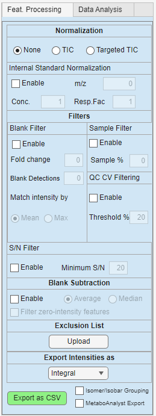

# Feature processing panel

The **Feature Processing** panel controls how detected or targeted features are filtered, normalized, summarized, and exported.

{ width="300px" }

The settings in this panel affect the active m/z feature list and the exported feature table. In general, filters remove features from the current feature list, while normalization changes the intensity values that are exported or used for analysis.

## Parameter overview

| Section | Purpose |
|---|---|
| Normalization | Selects how intensity values should be normalized |
| Internal Standard Normalization | Normalizes features using a selected reference m/z |
| Blank Filter | Removes features that are too abundant in blank samples |
| Sample Filter | Keeps features detected in enough sample sections |
| QC CV Filtering | Removes features with poor reproducibility in QC samples |
| S/N Filter | Removes features below a signal-to-noise threshold |
| Blank Subtraction | Subtracts blank signal from sample signal |
| Exclusion List | Removes user-specified m/z values |
| Export Intensities as | Selects how scan-level intensities are summarized |
| Export as CSV | Writes the processed feature table to a CSV file |
| Isomer/Isobar Grouping | Optional grouping of features with similar or ambiguous m/z values |
| MetaboAnalyst Export | Exports the table in a MetaboAnalyst-compatible format |

## Normalization

The **Normalization** section controls whether exported intensities are normalized.

| Option | Description |
|---|---|
| None | No normalization is applied |
| TIC | Intensities are normalized by total ion current |
| Targeted TIC | Intensities are normalized by the total signal of the targeted feature set |

Use **None** when you want to export the summarized raw intensities.

Use **TIC** when you want to correct for differences in total signal between samples or sections.

Use **Targeted TIC** when you want normalization to be based only on the features in the current analyte or m/z list.

## Internal standard normalization

Internal standard normalization divides feature intensities by the signal of a selected reference m/z.

| Parameter | Description |
|---|---|
| Enable | Turns internal standard normalization on or off |
| m/z | Reference m/z used as internal standard |
| Conc. | Optional concentration scaling factor |
| Resp.Fac | Optional response factor scaling value |

When enabled, DIP_IT searches for the internal standard m/z in the feature list using the selected ppm tolerance. If a matching feature is found, each feature is divided by the internal standard signal.

This is useful when a known internal standard was added to all samples and should be used to correct for variation in acquisition or ionization.

!!! note
    The m/z value is used to find the internal standard feature. The normalization uses the internal standard signal, not the m/z number itself.

## Blank filter

The **Blank Filter** removes features that are too abundant in blank samples.

| Parameter | Description |
|---|---|
| Enable | Turns blank filtering on or off |
| Fold change | Required sample-to-blank fold change |
| Blank Detections | Minimum number of blanks where the feature must be detected before the blank rule is applied |
| Match intensity by | Selects how blank intensity is summarized |
| Mean | Uses mean blank intensity |
| Max | Uses maximum blank intensity |

The blank filter compares sample signal against blank signal. Features that do not exceed the blank signal by the required fold change can be removed.

For example, if the fold change is set to `3`, a feature must be more than three times higher in samples than in blanks to pass the filter.

Use this filter to reduce background signals, contaminants, and carryover peaks.

## Sample filter

The **Sample Filter** removes features that are not detected in enough sample sections.

| Parameter | Description |
|---|---|
| Enable | Turns the sample filter on or off |
| Sample % | Minimum percentage of sample sections where the feature must be detected |

This filter is useful for removing features that occur only rarely or appear in too few samples to be useful for downstream analysis.

For example, if `Sample %` is set to `50`, a feature must be detected in at least half of the selected sample sections to pass.

## QC CV filtering

The **QC CV Filtering** option removes features with high variation across QC samples.

| Parameter | Description |
|---|---|
| Enable | Turns QC CV filtering on or off |
| Threshold % | Maximum allowed coefficient of variation in QC samples |

QC CV is calculated from the QC samples defined in the log file. A low CV means that a feature is reproducible across QC samples. A high CV suggests that the feature may be unstable, noisy, or poorly measured.

For example, if the threshold is set to `20`, features with QC CV above 20% are removed.

!!! note
    QC CV filtering requires samples labelled `qc` in the log file.

## S/N filter

The **S/N Filter** removes features with low signal-to-noise ratios.

| Parameter | Description |
|---|---|
| Enable | Turns S/N filtering on or off |
| Minimum S/N | Minimum required signal-to-noise ratio |

This filter is mainly intended for Thermo `.RAW` workflows where signal-to-noise information is available from the raw file.

Features with median S/N below the selected threshold are removed from the active feature list.

!!! note
    Signal-to-noise filtering is a quality filter. It should not be confused with exporting intensities as signal-to-noise ratios.

## Blank subtraction

**Blank Subtraction** subtracts the blank signal from non-blank samples or sections.

| Parameter | Description |
|---|---|
| Enable | Turns blank subtraction on or off |
| Average | Uses average blank signal for subtraction |
| Median | Uses median blank signal for subtraction |
| Filter zero-intensity features | Removes features where all sample intensities become zero after blank subtraction |

Blank subtraction is applied before normalization. If subtraction produces negative values, these values are set to zero.

The **Filter zero-intensity features** option removes features that have no remaining sample signal after blank subtraction. If the checkbox is disabled, those features can appear again.

!!! note
    Blank subtraction changes intensity values, while blank filtering removes features based on a sample-to-blank rule. These are related but different operations.

## Exclusion list

The **Exclusion List** removes user-specified m/z values from the feature list.

Use **Upload** to select a `.csv` or `.xlsx` file containing m/z values to remove. This can be useful for excluding known contaminants, calibration peaks, background ions, or unwanted features.

The exclusion list is applied as a filter. If the exclusion list is removed or disabled, the excluded features can be restored.

## Export intensities as

The **Export Intensities as** dropdown controls how scan-level intensities are summarized for export.

| Option | Description |
|---|---|
| Integral | Sums intensity across scans |
| Average including zeros | Calculates average intensity including zero values |
| Average excluding zeros | Calculates average intensity after ignoring zero values |
| Median | Calculates median intensity across scans |
| Signal-to-noise ratio | Exports S/N summaries instead of intensity values |

For most quantitative analysis, use **Integral**, **Average**, or **Median**.

Use **Signal-to-noise ratio** when the goal is to inspect feature quality rather than abundance.

## Export as CSV

The **Export as CSV** button writes the processed feature table to a CSV file.

The exported table usually contains:

| Column type | Description |
|---|---|
| m/z | Feature m/z value |
| annotation | Feature name or annotation, if available |
| sample or section columns | Processed intensity values |

The exported features reflect the currently active filters. If filters remove features from the m/z list, those features are not included in the export.

## Isomer/Isobar grouping

The **Isomer/Isobar Grouping** option is intended for grouping features that may represent the same nominal mass, overlapping m/z values, or ambiguous feature assignments.

Use this option when features are difficult to distinguish by m/z alone and should be reported together or flagged during export.

## MetaboAnalyst export

The **MetaboAnalyst Export** option writes the feature table in a format suitable for upload to MetaboAnalyst.

The MetaboAnalyst export includes sample names, class labels, feature names, and intensity values in the expected layout.

When annotations are available, they can be used as feature names. Otherwise, DIP_IT can use m/z-based feature labels.

## Example workflow

Example of a typical workflow can be:

1. Load the experiment and optional analyte list.
2. Confirm that sample, blank, and QC labels are correct.
3. Choose an intensity summary mode.
4. Apply sample occurrence filtering.
5. Apply blank filtering or blank subtraction if blanks are available.
6. Apply QC CV filtering if QC samples are available.
7. Apply S/N filtering if using raw files with S/N values.
8. Choose a normalization method.
9. Export the processed feature table.

## Practical tips

- Check class labels before applying blank or QC filters.
- Use blank filtering to remove background-like features.
- Use blank subtraction when you want to correct intensity values for blank signal.
- Use QC CV filtering to remove unstable features.
- Use S/N filtering as a feature quality filter.
- Recheck the m/z feature list after changing filters.
- If a filter removes too many features, lower the threshold or disable the filter and rebuild the list.
