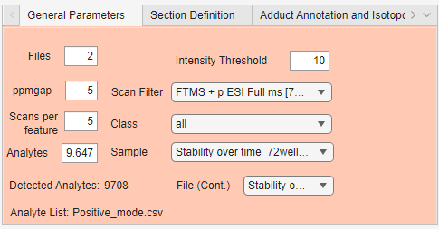

# General Parameters
The general parameters panel summarizes the currently loaded experiment and contains settings used during feature detection, filtering, and sample selection.

{ width="500px" }

## Parameter overview

| Parameter | Description |
|---|---|
| Files | Number of loaded files or source files in the experiment |
| ppmgap | Mass tolerance used for m/z matching, feature detection, and targeted extraction |
| Scans per feature | Minimum number of scans where a feature should be detected |
| Analytes | Number of m/z values currently available in the analyte list or feature list |
| Detected Analytes | Number of analytes/features detected from the loaded data |
| Analyte List | Name of the loaded analyte list file |
| Intensity Threshold | Minimum intensity threshold used during feature detection |
| Scan Filter | MS scan filter selected for feature extraction |
| Class | Class selector used to filter or display samples by class |
| Sample | Sample selector used to choose a specific file, sample, or section |
| File (Cont.) | Source-file selector for continuous acquisition experiments |

## Files

The **Files** field shows how many source files have been loaded into the experiment.

In sequential mode, this usually corresponds to the number of samples, blanks, and QC files.

In continuous mode, this refers to the number of source files, while each file may contain several detected sections.

## ppmgap

The **ppmgap** field defines the mass tolerance in parts per million (ppm).

This tolerance is used when matching observed m/z values to target m/z values. A smaller ppm value is stricter, while a larger value allows broader matching.

## Intensity Threshold
The **Intensity Threshold** field defines the minimum intensity required for feature detection.
Features below this threshold are ignored during feature finding. Increasing the threshold can remove low-intensity noise, while decreasing it can retain weaker signals.

## Scans per Feature
The **Scans per feature** field defines how many scans must contain a feature before it is considered detected.

Higher values make feature detection stricter and can reduce noise. Lower values allow features that appear in fewer scans to be retained.

This setting is especially relevant for continuous or section-based data, where a feature may appear only within part of a section.
 
!!! note
    Only scans contained in sample classes are considered. This means that scans in any section labeled as `qc` or `blank` will be ignored

## Class

Filters the Sample dropdown to only show the sections corresponding to the selected class. For example, selecting the "QC" class will only show the sections labeled as QC in the sample dropdown.

## Sample
The Sample dropdown selects a specific section from the loaded experiment.
This is used for plotting the chronogram of the selected m/z in in the selected section.

The displayed names come from the sample column in the log file when available.

## Analytes

Shows the number of analytes in the target list, if it's uploaded.

## Detected Analytes

The Detected Analytes field shows how many features were detected from the loaded data using the current detection settings and applied filters.

## Analyte list
Shows the name of the uploaded analyte list.

## File (Continuous)
The application supports simultaneously uploading multiple continuously acqusitioned experiments as separate files in order to align them to a common feature list. The dropdown is used to switch between continuous files, and is used to select which file to use when plotting features in the chronogram.  