# MS/MS annotation and spectrum tools

## MS/MS spectrum viewer

The **MS/MS Spectrum Viewer** is used to inspect tandem mass spectra from loaded raw or mzML data. It is useful for checking individual MS/MS scans, comparing scan filters, averaging repeated spectra, and running database searches from the selected spectrum.

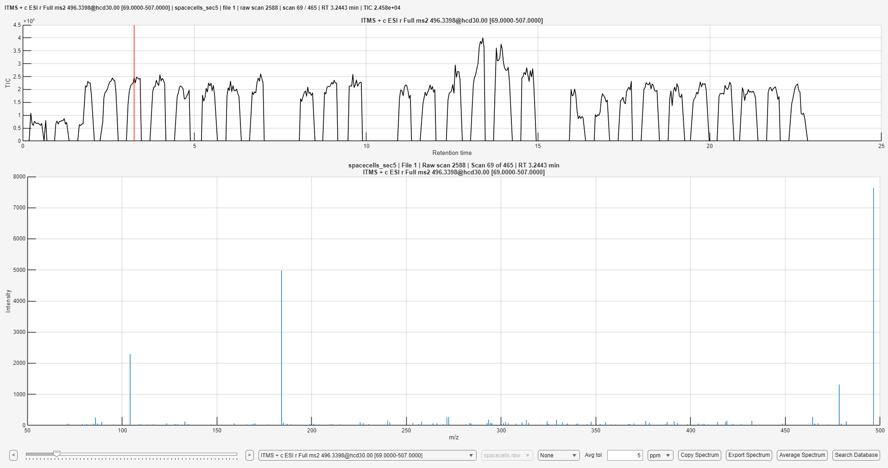{ width="1000px" }
/// caption
The MS/MS spectrum viewer showing the TIC plot, selected scan marker, spectrum plot, scan filter dropdown, and additional controls.
///

The viewer contains two linked plots:

| Plot | Description |
|---|---|
| TIC plot (top) | Shows the total ion current across scans for the selected scan filter or file |
| Spectrum plot (bottom) | Shows the MS/MS spectrum for the currently selected scan or averaged scan range |

Use the left and right arrow buttons, keyboard arrow keys, or the click on a scan in the TIC plot to move through scans. The vertical line in the TIC plot follows the currently selected scan.

### Opening the viewer

Open the viewer from the "Spectrum Viewer" button in the MS/MS Annotation panel after loading a file that contains MS/MS scans.

The viewer uses the currently selected scan filter when possible. If a scan filter contains only one scan, or if all scans should be inspected together, the viewer can show **All scans**.


### Scan filter selection

The scan filter dropdown controls which scans are shown in the viewer.

Selecting a scan filter updates the TIC plot and the spectrum plot to only use scans from that filter. 

If several files are loaded, the file dropdown selects which file is being inspected. When file information is available from the log file, the dropdown shows the file name.

### Inspecting individual spectra

The lower plot shows the spectrum for the selected scan. 

Use individual scan inspection to check:

- whether the selected scan contains meaningful fragment peaks
- whether the scan filter is the expected precursor or isolation window
- whether the spectrum is empty, noisy, or saturated
- whether repeated scans look consistent

The **Copy Spectrum** button copies the currently displayed spectrum as a tab-delimited table with m/z and intensity columns.

The **Export Spectrum** button saves the currently displayed spectrum to a .csv file.

### Averaging spectra

The **Average Spectrum** button averages spectra from the selected scan filter or selected scan range.

When averaging, DIP_IT aligns peaks across scans using the current average tolerance:

| Setting | Meaning |
|---|---|
| Avg tol | Maximum allowed distance between peaks before they are treated as separate m/z values |
| ppm / Da | Selects whether the average tolerance is interpreted in parts per million or Dalton |

For high-resolution data, ppm is often a good default. For low-resolution or rounded fragment libraries, Dalton tolerance may be more practical.

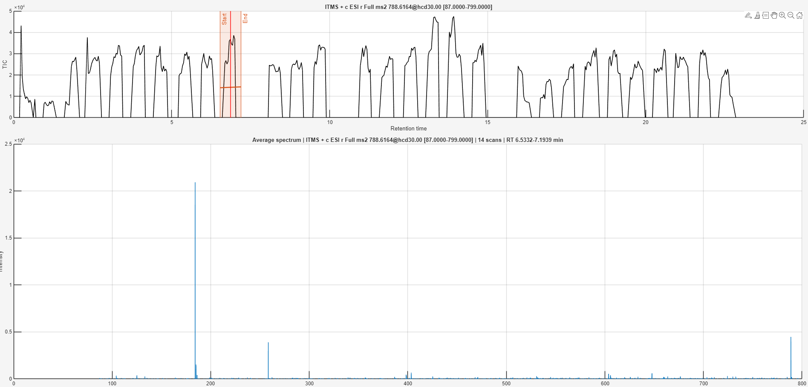{ width="1000px" }
/// caption
A mouse range selection on the TIC plot and the averaged spectrum shown below.
///

### Mouse selection over scans

Click and drag across the TIC plot to select a scan range.

After selecting a range, DIP_IT averages the spectra from scans inside that retention-time region. The lower spectrum plot updates to show the averaged spectrum.

This is useful when:

- several repeated MS/MS scans were acquired for the same scan filter
- a single scan is noisy but nearby scans are consistent
- you want a cleaner query spectrum for database matching
- you want to compare spectra before and after changing the averaging tolerance

### Database matching

The **Search Database** button searches the current scan or averaged spectrum against a loaded MS/MS library.

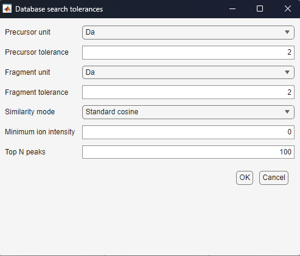{ width="400px" }
/// caption
The MS/MS database search settings dialog popup, which is shown after pressing the "Search Database" button.
///

The database search settings include:

| Setting | Description |
|---|---|
| Precursor unit | Uses Dalton or ppm for precursor matching |
| Precursor tolerance | Maximum allowed difference between query precursor m/z and library precursor m/z |
| Fragment unit | Uses Dalton or ppm for fragment matching |
| Fragment tolerance | Maximum allowed difference between query and library fragment peaks |
| Similarity mode | Selects standard cosine or modified cosine scoring |
| Relative TIC threshold | Removes query peaks below the selected fraction of the spectrum TIC |
| Top N peaks | Keeps only the most intense peaks before scoring |

Use **Standard cosine** for stricter matching of the same compound. Use **Modified cosine** when searching for related spectra or analogues where fragments may shift with the precursor mass difference. [Link to a comparison between both metrics.](https://doi.org/10.1021/jasms.2c00153)

After setting the parameters, select which database(s) the spectra should be matched against. DIP_IT provides a selection of commonly used MS/MS libraries in the form of .mat files. The database search supports searching in multiple databases simultaneously by multi-selecting which databases to search in.

The database matching then returns a table of candidate library hits, initially sorted by the lowest ppm error.

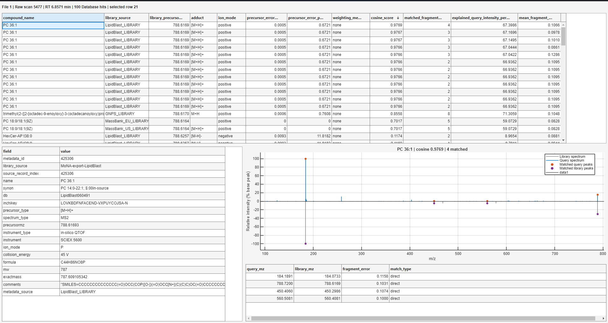{ width="1000px" }
/// caption
Database search results for an MS2 spectra with parent ion m/z 788.6164, sorted by cosine score. The results suggests that the fragmentation pattern matches that of PC 36:1. 
///

 The columns in the result table include:

| Column | Description |
|---|---|
| `compound_name` | Candidate library compound name |
| `library_source` | Source database file used for the match |
| `query_precursor_mz` | Precursor m/z used for the query |
| `library_precursor_mz` | Library precursor m/z |
| `precursor_error_da` / `precursor_error_ppm` | Difference between query and library precursor m/z |
| `cosine_score` | Spectral similarity score |
| `matched_fragment_count` | Number of matched fragments |
| `explained_query_intensity_percent` | Percent of query signal represented by matched peaks |

### Library metadata

When the selected database was converted with metadata, the database match viewer shows the metadata for the selected hit below the match table. Selecting a different database hit updates the metadata panel automatically.

The metadata panel can include fields such as:

| Metadata field | Description |
|---|---|
| `compound_name` | Name of the matched library compound |
| `formula` | Molecular formula, when available |
| `exact_mass` | Neutral exact mass, when available |
| `adduct` | Ion/adduct form stored in the library entry |
| `ion_mode` | Positive or negative mode annotation |
| `instrument` | Instrument or analyzer used for the library spectrum |
| `collision_energy` | Collision energy or normalized collision energy for the library spectrum |
| `SMILES` | Text representation of the molecular structure |
| `InChI` | Standardized International Chemical Identifier |
| `InChIKey` | Short hashed identifier derived from the InChI |
| `accession` | Database accession or record identifier |

SMILES is the most useful field for drawing or previewing a chemical structure. InChI is useful for exact structural identity, while InChIKey is useful for grouping duplicate entries across databases.

If the metadata panel says that no metadata table entry was found, the selected database file still works for spectral matching, but it was probably converted without the full metadata table. In that case, only the compact matching fields are available.

!!! info
    The parent ion used for matching the database libraries is automatically extracted from the scan filter. It is therefore important that the scan filter contains the name of the parent ion. 

### Mirror plot

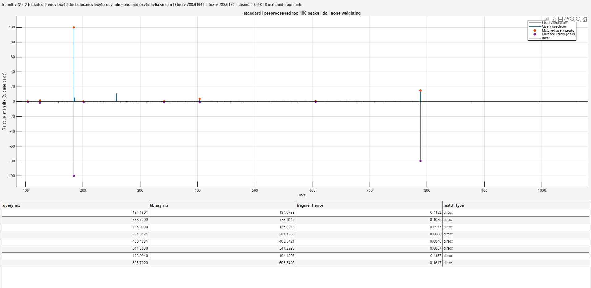{ width="1000px" }
/// caption
Mirror plot of PC 36:1. Top shows the query spectrum, and the bottom shows the library spectrum. Matches are determined based on the tolerance parameters set in the search.
///

The database result viewer shows a mirror plot for a selected hit.

The query spectrum is plotted above zero and the library spectrum is plotted below zero. Both spectra are normalized to relative base-peak intensity for display, so the tallest peak in each spectrum is shown on a comparable scale.

Use the mirror plot to check whether a high database score is supported by meaningful fragment matches or by only a few intense peaks.

### Stepped MS/MS deconvolution

The **Stepped MS/MS Deconvolution** tool reconstructs spectra from stepped isolation data. It is useful when a wide or imperfect isolation window fragments more than one compound, producing chimeric MS/MS spectra.

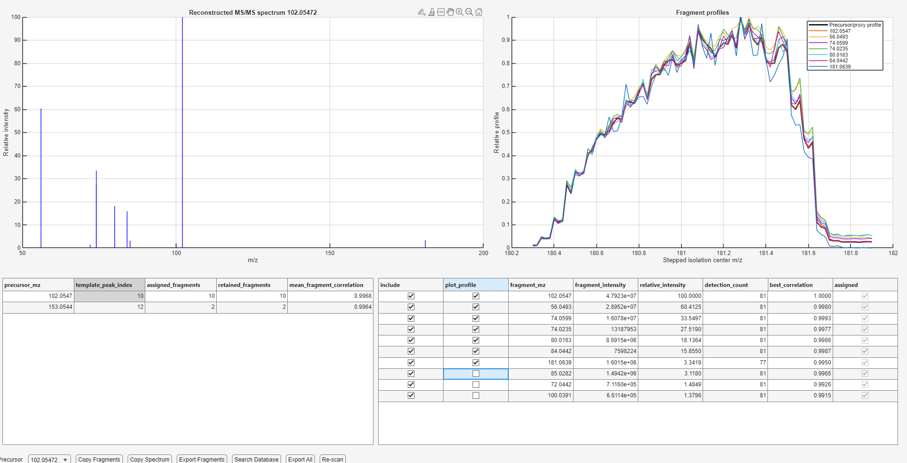{ width="1000px" }
/// caption
The stepped deconvolution window. Fragment profiles are correlated with anchor or proxy ions to reconstruct compound-specific spectra.
///

The idea is easiest to understand by thinking about a mixed MS/MS spectrum. In ordinary MS/MS, the instrument isolates an m/z window and fragments everything inside that window. If two compounds are close in m/z, both compounds can enter the collision cell at the same time. The resulting spectrum is then chimeric: some fragments come from compound A, some fragments come from compound B, and the normal spectrum plot does not directly tell you which fragment belongs to which compound.

Stepped MS/MS acquisition helps by repeating the fragmentation while slightly moving the isolation center. For example, instead of fragmenting only at one center such as `343.0`, the method may collect scans at:

```text
342.4, 342.5, 342.6, 342.7, 342.8, ...
```

The isolation window is not a perfect square gate. An ion close to the center of the isolation window is transmitted more strongly than an ion near the edge. Therefore, as the isolation center moves, each precursor gets a characteristic intensity pattern across the stepped scans.

For example, one compound might be strongest early in the stepped series:

```text
Compound A profile: low -> medium -> high -> high -> medium -> low
```

while another nearby compound might peak slightly later:

```text
Compound B profile: low -> low -> medium -> high -> high -> medium
```

Fragments follow the compound that produced them. If fragment `102.0549` belongs to compound A, then the intensity of fragment `102.0549` should rise and fall like compound A across the stepped scans. If fragment `135.0438` belongs to compound B, it should rise and fall like compound B instead.

This is what DIP_IT uses for deconvolution. It does not assign fragments mainly from their m/z value. Instead, it asks:

> Which fragments have similar intensity profiles across the stepped scans?

Fragments with similar profiles are grouped into a reconstructed spectrum. This can turn one mixed/chimeric MS/MS spectrum into two or more cleaner reconstructed spectra.

#### Proxy or anchor ions

The deconvolution needs one or more reference ions, called **proxy ions** or **anchor ions**. A proxy ion is a fragment or ion whose profile represents one compound. DIP_IT compares every other fragment profile to the proxy profiles.

The proxy ion does **not** have to be the molecular precursor. It can be:

- a known diagnostic fragment for a compound
- a fragment found from the literature or a standard
- a visually distinct ion from the fragment network that is manually entered into the proxy list
- an automatically suggested ion from DIP_IT

If you know a diagnostic fragment, use it as an anchor. If you do not know one, the auto-proxy option tries to choose intense ions with different profile shapes. This is useful for exploratory work, but the result should still be checked with the reconstructed spectra and database matches.

#### How auto proxy selection works

The auto-proxy option is meant to give DIP_IT reasonable starting anchors when the user does not already know diagnostic fragment ions. It does not prove which compound is present. It only chooses candidate ions that are likely to produce useful reference profiles.

Inside the stepped deconvolution tool, DIP_IT chooses proxy ions in this order:

1. **Use manual proxy ions first.**  
   If the seed/proxy m/z list contains valid ions that are found in the spectrum within the selected fragment tolerance, those ions are used directly. One proxy ion can be used for targeted extraction. Two or more proxy ions can be used for competitive deconvolution.

2. **Look near the stepped isolation region.**  
   If no valid manual proxy is supplied, DIP_IT estimates the m/z region covered by the stepped isolation centers and isolation width. It then looks for candidate peaks inside that region.

3. **Choose the strongest candidate peaks.**  
   Within the isolation region, DIP_IT sorts candidate peaks by intensity and keeps up to the selected **Auto proxy count**.

4. **Fall back to the strongest overall peaks if needed.**  
   If the isolation region does not contain enough candidates, DIP_IT falls back to the strongest peaks in the template spectrum.

This means that auto proxy selection is intensity-driven in the stepped deconvolution dialog. It assumes that useful proxy ions are among the stronger peaks in or near the stepped isolation region.

When deconvolution is opened from the **Fragment Network**, DIP_IT does not automatically choose proxy ions from the selected group. The network is used as an exploratory view only. The user must inspect the network and decide which fragment ions are useful anchors. Enter one proxy m/z value to extract fragments correlated with that anchor, or enter two or more proxy m/z values to split fragments between competing anchors.

!!! note
    Auto proxy selection is exploratory. It can work well when the different compounds have distinct stepped profiles, but it can also choose two strong ions from the same compound. Always inspect the fragment profiles, reconstructed spectra, and database matches before accepting the result.

The workflow is:

1. Select a stepped MS/MS scan filter block.
2. Provide the comma-delimited anchor or proxy m/z values, or let the auto-proxy option suggest them. 
3. DIP_IT extracts fragment profiles across the stepped scans.
4. Each fragment is compared to the proxy profiles.
5. Fragments are assigned to the proxy ion with the best profile relationship.
6. The assigned fragments are shown as reconstructed spectra.

With one proxy ion, DIP_IT performs targeted extraction:

```text
keep fragment if correlation(fragment profile, proxy profile) >= minimum correlation
```

With two or more proxy ions, DIP_IT performs competitive deconvolution:

```text
assign fragment to the proxy it follows best, if the best correlation passes the threshold
```

#### Example interpretation

Suppose a stepped block contains two proxy ions:

```text
Proxy 1: 102.0549
Proxy 2: 135.0438
```

DIP_IT extracts the intensity profile of both proxy ions across the stepped scans. It then extracts profiles for all other detected fragments. If fragment `84.0440` follows the same pattern as `102.0549`, it is assigned to the reconstructed spectrum for proxy 1. If fragment `123.0438` follows the same pattern as `135.0438`, it is assigned to the reconstructed spectrum for proxy 2.

The output is therefore not just a filtered version of the original spectrum. It is a reconstructed spectrum made from fragments that behave similarly across the stepped acquisition.

Important settings include:

| Setting | Description |
|---|---|
| Scope | Which scans are used for reconstruction |
| Fragment tolerance | Peak grouping tolerance for fragment m/z values |
| Minimum correlation | Minimum profile similarity required for assigning a fragment |
| Proxy / anchor m/z values (comma-delimited) | Anchor ions used as profile references |
| Auto proxy count | Number of proxy ions DIP_IT should suggest automatically |
| Relative TIC threshold | Removes very small peaks relative to the total ion current |
| Top N fragments | Limits the reconstructed spectrum to the strongest fragments |

Use stricter settings when the reconstruction contains too many unrelated fragments. Use looser settings when too few fragments are assigned.

Practical interpretation:

- **High minimum correlation** gives cleaner but smaller reconstructed spectra.
- **Low minimum correlation** keeps more fragments but can include unrelated ions.
- **Relative TIC threshold** removes weak peaks based on their contribution to the spectrum TIC.
- **Top N fragments** keeps the display and database query manageable.

!!! tip
    If the reconstructed spectrum gives a strong database hit and the mirror plot shows several meaningful matched fragments, that is stronger evidence than a high score based on only one or two peaks. Always check the reconstructed spectrum visually.

### Deconvoluted spectrum database search

A reconstructed spectrum from the stepped deconvolution viewer can be searched against the same MS/MS libraries used by the regular spectrum viewer.

The same interpretation rules apply as for regular database matching. A strong candidate should have a plausible precursor error, a high similarity score, enough matched fragments, and a mirror plot that supports the assignment.

The deconvoluted spectrum database search uses the same practical search settings as the regular MS/MS database search: precursor tolerance, fragment tolerance, similarity mode, relative TIC threshold, and top N peaks. The main extra input is the **Library precursor m/z**, because a reconstructed spectrum may be based on a proxy fragment rather than the true precursor ion. **This needs to be set by the user, as the library precursor m/z can not be determined from the scan filter.**

### Fragment correlation network

The **Fragment Network** tool is an exploratory companion to stepped deconvolution. It shows which fragment ions have similar intensity profiles across scans or stepped scan filters before you choose proxy ions or reconstruct spectra. It is mainly intended for data where the isolation center has been moved stepwise across a narrow m/z range.

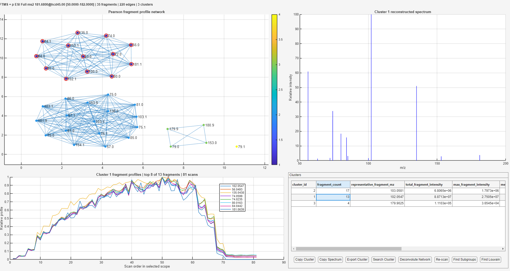{ width="1000px" }
/// caption
The fragment network window. Top left shows the ion fragmentation networks, where nodes represent fragment ions and edges connect ions with similar intensity profiles. Top right shows the spectra corresponding to the fragments of the currently selected group. Bottom right shows metadata about the different groups.  
///

In the network:

| Element | Meaning |
|---|---|
| Node | A fragment ion m/z detected across the selected MS/MS scans |
| Edge | A profile similarity relationship between two fragment ions |
| Node color | Group or community assignment used for visualization |
| Node label | Fragment m/z |
| Selected outline | The currently selected group of fragments |

The network is built from fragment intensity profiles. Each fragment receives a vector of intensities across the scans used for the network. Fragments that rise and fall together are connected if their similarity is above the selected threshold. The similarity method used for correlation is the Pearson correlation coefficient.

Important network settings include:

| Setting | Description |
|---|---|
| Scope | Controls whether the network uses all scans, the current sample, or the current stepped block |
| Fragment tolerance | Groups nearby fragment peaks before building profiles |
| Minimum Pearson similarity | Minimum profile similarity required to draw an edge |
| Relative TIC threshold | Removes very small peaks relative to each scan TIC |
| Top N fragments | Limits the network to the most intense fragments |

Increasing the minimum Pearson similarity makes the graph stricter. Weak bridge edges disappear, so large mixed groups can split into smaller groups. As fragments from the same parent ion are supposed to be significantly correlated, a high correlation threshold is often needed to distinguish the groups. A good starting point is having a threshold set at approximately 0.98, and slowly increasing it when required.

### Network groups and subgroups

The fragment network has several ways to define a selected group:

| Grouping mode | Description |
|---|---|
| Connected clusters | Default grouping. Fragments connected by any path are placed in the same group |
| Find Subgroups | Performs hierarchical clustering of fragment profiles within the network |
| Find Louvain | Performs graph community detection on the weighted fragment network |
| Manual brushing | Lets the user drag over nodes and create a custom group |

**Find Subgroups** uses hierarchical clustering on profile distances:

```matlab
profileDistance = pdist(X, "correlation");
linkageTree = linkage(profileDistance, "average");
```

Here, `profileDistance` is `1 - Pearson correlation` between fragment profiles. Average linkage compares clusters using the average distance between all fragments in the two clusters.

**Find Louvain** uses the weighted network structure. It tries to find communities where fragments are more strongly connected to each other than to the rest of the graph.

These methods answer slightly different questions:

| Method | Best for |
|---|---|
| Connected clusters | Fast overview of which ions are connected at the selected threshold |
| Hierarchical subgroups | Splitting a large connected group based on profile-shape distance |
| Louvain communities | Finding dense communities in the graph topology |
| Manual brushing | Testing a user-defined set of ions seen in the plot |

!!! note
    Finding subgroups using hierarchical clustering and Louvain is an experimental feature that will require more testing and validation in the future.

### Manual node brushing

Manual brushing lets you drag over nodes in the fragment network and treat the selected nodes as a temporary group.

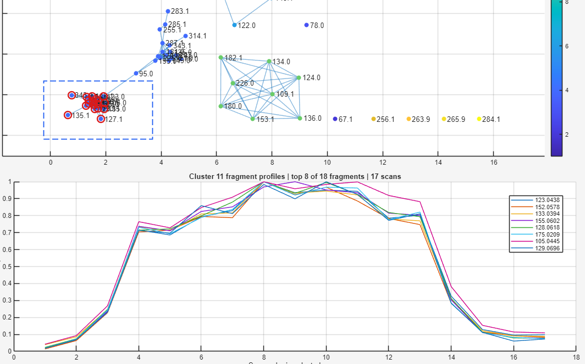{ width="1000px" }
/// caption
Manual brushing over the nodes. Dragging over nodes creates or updates a manual brushed group.
///

When nodes are brushed:

- a row containing the brushed ions is added to the group table
- re-dragging updates the same brushed row instead of adding repeated rows
- the original cluster, subgroup, or Louvain rows remain in the table
- the brushed group can be copied, exported, or searched against databases
- if the group suggests useful anchor ions, those m/z values can be entered manually in stepped deconvolution

This is useful when the automatic grouping is close but you want to test a specific visual subset of ions, or when a subset in general is clearly visible in the network. 

### Example workflow: resolving a chimeric stepped MS/MS spectrum

!!! info
    This example reconstructs the results from [this article](https://doi.org/10.1002/rcm.10170) with their own data. The .mzml files and the log file can be downloaded [here](https://drive.google.com/drive/folders/1VxqQJpqVuT5udNFgkBikHfqredsZxNrH?usp=sharing).

This example describes a typical exploratory workflow using two stepped `.mzML` files. The exact filenames may differ, but the idea is the same: load stepped MS/MS data, inspect the fragment network, tune the network until the mixed group separates, then search the selected reconstructed group against a database.

#### 1. Load the example data

Start off by loading the log file contained in the example files folder in sequential mode. Open the **MS/MS Spectrum Viewer**, and in the scan filter dropdown, select the stepped MS/MS scan filter block that covers the m/z region of interest.

For stepped data, the scan filters should look like a series of related MS/MS scans with gradually changing isolation centers. For example:

```text
Full ms2 180.3000@hcd45.00
Full ms2 180.3200@hcd45.00
Full ms2 180.3400@hcd45.00
Full ms2 180.3600@hcd45.00
...
```

This indicates that the same m/z region was fragmented repeatedly while the isolation center was moved stepwise.

#### 2. Open the fragment network

Open the **Fragment Network** for the selected stepped block. At the first settings, the network may show one large group containing many fragments. It can also show secondary networks that are not the main chemical target. 

!!! note
    For stepped isolation data, one common pattern is one or several networks that mainly collects ions near the edge of the isolation stepping interval. These networks are usually not the group to use for compound annotation. Instead, select the network that has ion intensities across the whole stepping window.

| Network of interest | Network of disinterest |
|---|---|
| 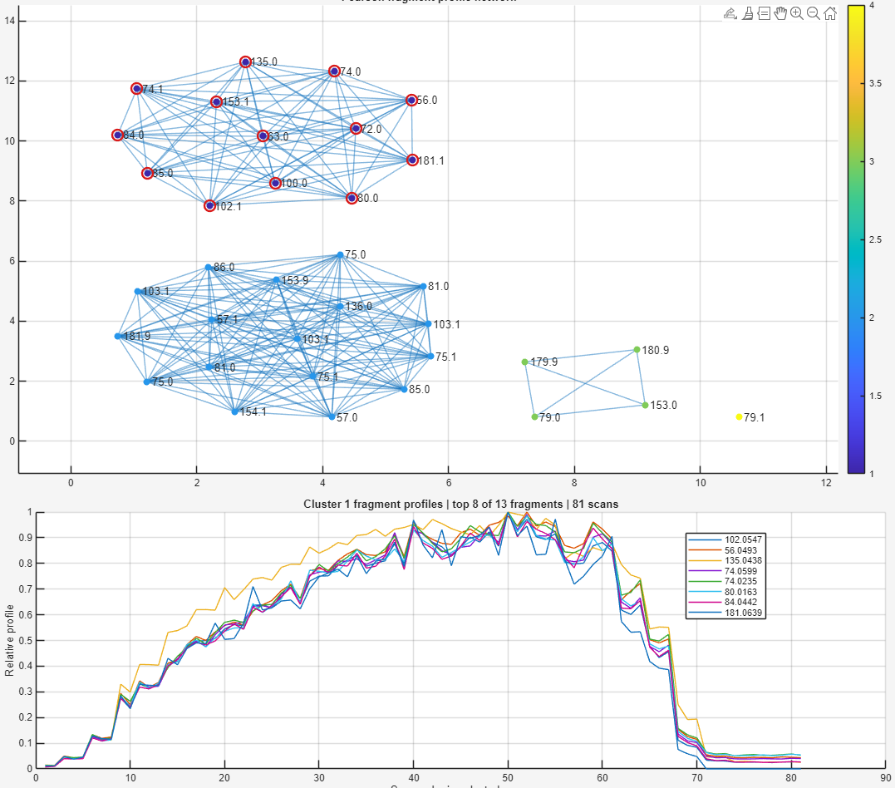{ width="480px" } | 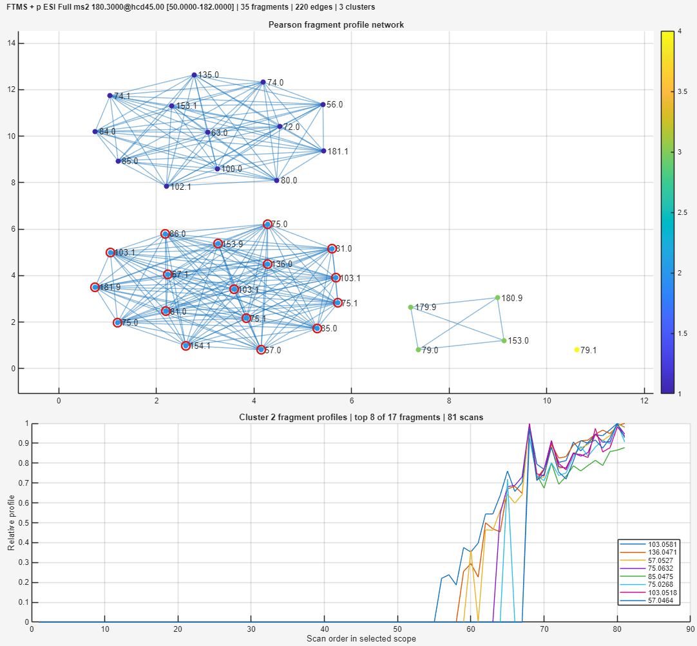{ width="480px" } |

/// caption
The main correlated fragment network with a edge-interval network. The left image shows the large network or cluster that contains the fragments of interest. The right image shows the non-relevant network that mostly collects ions not of interest at the edge of the isolation stepping intervals.
///

This often means that the current threshold is too permissive. A few bridge fragments can connect fragments from different compounds into one large group. Side fragments or noisy low-intensity ions can also make the graph look more connected than the actual chemistry.

At this stage, inspect the network visually:

- look for central groups of strongly connected fragments
- avoid obvious side fragments that only weakly connect to the main structure
- check whether the selected group spectrum contains chemically meaningful peaks
- use manual brushing if a useful subset is visually clear

#### 3. Tighten the correlation threshold

If the group is too large, increase the **Minimum Pearson similarity** threshold and re-run the network. In the image above, we used a correlation threshold of 0.7. A stricter threshold removes weak bridge edges. This can split a chimeric group into smaller groups that better represent separate compounds.

!!! note
    To split a large connected network group, the usual adjustment is to **increase** the minimum Pearson similarity threshold. Lowering the threshold usually adds more edges and can merge groups together. If too few ions are visible, lower the relative TIC threshold or increase the Top N fragments value.

| Network starting to split | Split network (Methionine Sulfoximine) | Split Fragment |
|---|---|---|
| 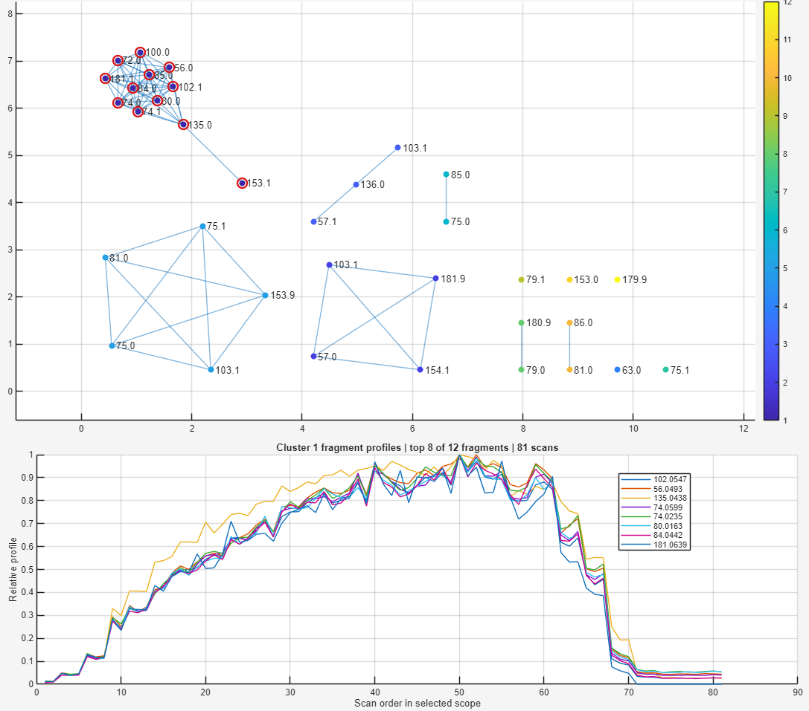{ width="320px" } | 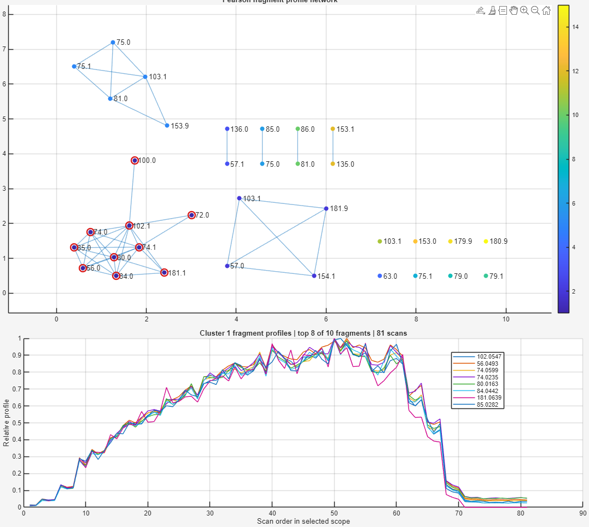{ width="320px" } | 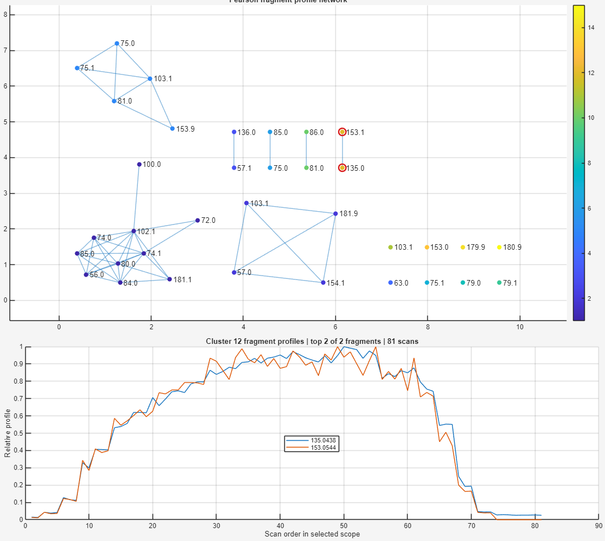{width="320px"} |

/// caption
The result of increasing the correlation threshold on the network. Starting from a correlation threshold of 0.985, the network can be seen startin to split. At correlation threshold of 0.99, the network has split into two, one corresponding to the spectra of Methionine Sulfoximine, and the other of the chimeric fragment.
///

Once the chimeric group splits, select the group that represents the main correlated fragment profile. In practice, this is often the group with central, high-quality fragments rather than isolated side/noise fragments. If needed, use **Manual brushing** to select exactly the nodes that should be tested.


#### 4. Search the selected group

With the group selected, press **Search Cluster** to search the selected reconstructed fragment group against the MS/MS databases.

The **Search Cluster** dialog uses the same search settings as the regular spectrum viewer database search: precursor tolerance, fragment tolerance, similarity mode, relative TIC threshold, and top N peaks. The only extra field is **Library precursor m/z**, which tells DIP_IT which precursor mass to use when matching the selected fragment group against library entries.

| Database search of cluster | Mirrored Spectra |
|---|---|
| 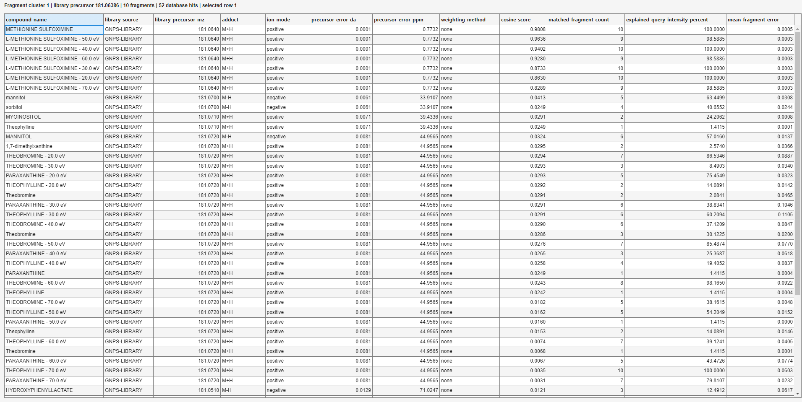{ width="480px" } | 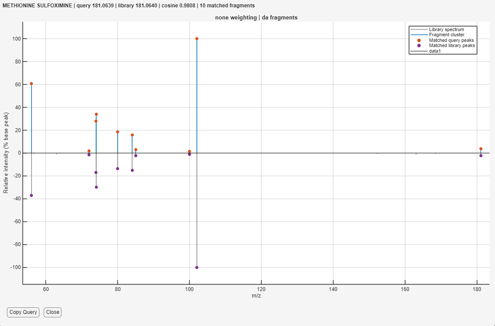{ width="480px" } |
/// caption
 Database match of metionine sulfoximine, and the query spectrum mirrored with the database spectrum.
///


For example, one selected group from a stepped test dataset matches **Methionine sulfoximine** with a very high cosine score and low precursor error. The exact hit depends on the dataset, ion mode, libraries installed, and the selected group.

Interpret the result using several pieces of evidence together:

- precursor error should be plausible
- cosine score should be high
- several fragments should be matched, not only one peak
- explained query intensity should be meaningful
- the mirror plot should visually support the match
- the selected group should have a coherent profile in the fragment network

#### 5. Confirm with stepped deconvolution

| Selected proxy ions | Reconstructed spectra from proxy from m/z 80.0163 | Reconstructed spectra from proxy 153.0544 |
|---|---|---|
| 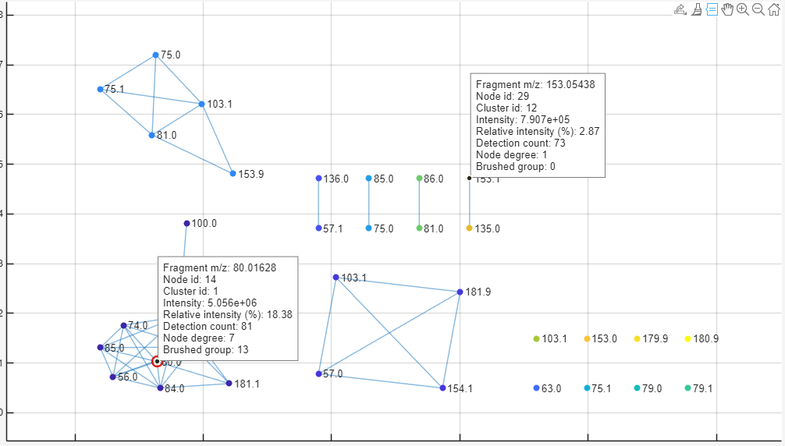{ width="320px" } | 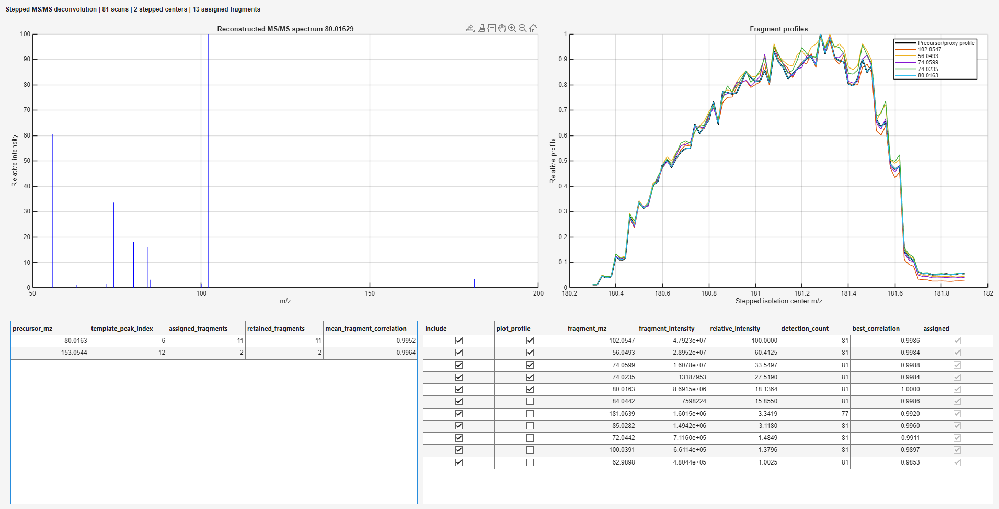{ width="320px" } | 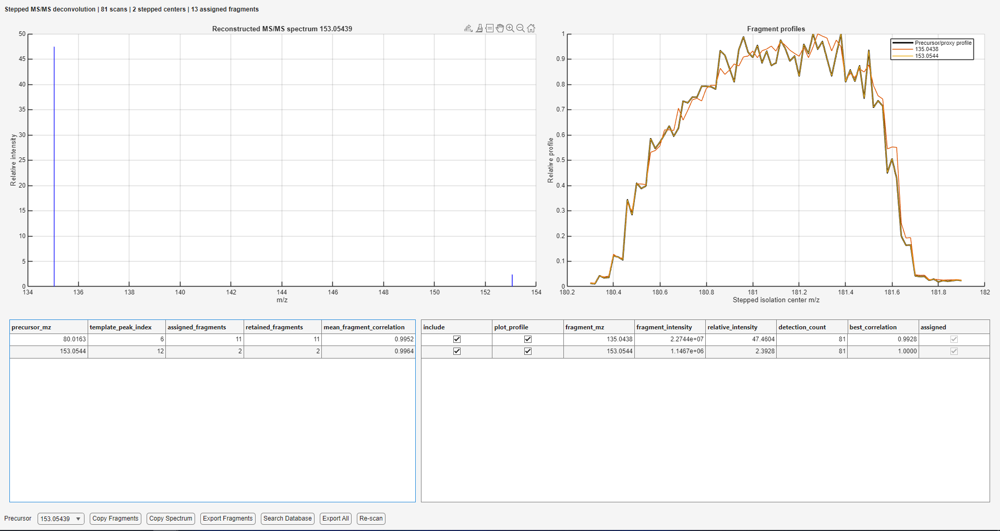{width="320px"} |
/// caption
 Proxy ions used for selection, and the resulting two spectra reconstructed from those proxy ions. The m/z for the first proxy ion was selected because it was in the center of the cluster.
///

If the network split gives a promising group, inspect the group and decide which fragment m/z values should be used as proxy ions. Then open the **Stepped MS/MS Deconvolution** tool and enter those proxy m/z values manually. The deconvolution viewer reconstructs spectra from fragments that follow each proxy profile. Search the reconstructed spectrum again and compare the database result with the network-based search.

This gives a useful sanity check:

- the fragment network shows whether ions cluster by profile
- stepped deconvolution reconstructs proxy-specific spectra
- database search tests whether the reconstructed spectrum resembles a known compound

If all three agree, the annotation is much stronger than a raw chimeric MS/MS search alone.

### Example workflow: difficult 342/343 isobaric data

The 180 example is a good first validation case because the profiles can separate cleanly and the reconstructed spectrum can produce a strong database match. The 342/343 stepped data are more difficult. In the paper, these data are discussed as **isobaric mixtures**, meaning the compounds have very similar nominal mass and can be isolated and fragmented together. The most difficult case is the 342A + 342B mixture, where the two ions are extremely close in m/z (0.006 Da difference). The paper reports that this close spacing makes the modulated intensity profiles overlap strongly, especially on the Q-Orbitrap data.

Use this example as a stress test for the workflow rather than as the first case to learn the tool.

#### 1. Load the 342/343 stepped file

Load the `.mzML` file for the 342/343 stepped region and open the **MS/MS Spectrum Viewer**. The scan filters should step through the nominal 342/343 isolation region, for example:

```text
Full ms2 342.4000@hcd45.00
Full ms2 342.5000@hcd45.00
Full ms2 342.6000@hcd45.00
Full ms2 342.7000@hcd45.00
...
```

The exact values depend on the instrument method, but the important feature is the same: the isolation center moves stepwise across a narrow m/z window.

#### 2. Inspect profile overlap

For very close isobars, the stepped intensity profiles may not be cleanly separated. The lower-mass ion should generally appear earlier in the stepping series and disappear earlier, while the higher-mass ion appears slightly later. However, when the m/z difference is very small, those profiles can overlap so much that the fragments are harder to assign. In this example, the difference is only 0.006 

| Fragment network | Overlapping profiles |
|---|---|
| 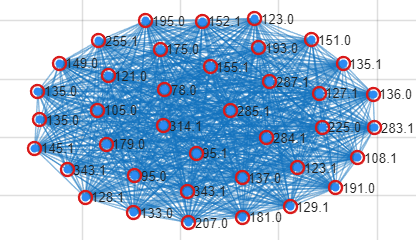{ width="480px" } | 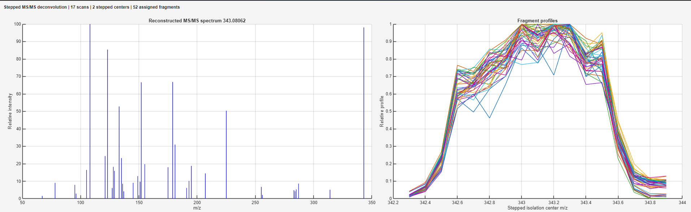{ width="480px" } |

/// caption
Network and overlapping profile of ~40 fragment ions from the isobaric mixture.  
///

#### 3. Tune more conservatively than the 180 case

| Fragment network (0.99 correlation threshold) | Fragment Network (0.995 correlation threshold) |
|---|---|
| 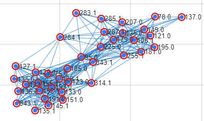{ width="480px" height="480px" } | 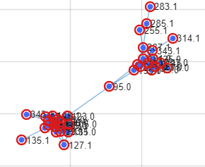{ width="480px" height="480px" } |
/// caption
The fragment network splitting from slowly increasing the correlation threshold. From here, you can either continue to increase the correlation threshold to split the network even more, manually select the ions of interest by brushing, use the stepped deconvoluter on candidate proxy ions from the clusters, or use hierarchical/Louvain clustering to detect subgroups.
/// 

For the 342/343 data, expect to spend more time tuning the fragment network:

- increase **Minimum Pearson similarity** gradually until bridge edges (in this case, m/z 95.0) disappear and the network splits
- lower **Relative TIC threshold** if too few useful fragments are visible
- use **Top N fragments** to keep the network readable
- use **Find Subgroups** to split one large connected group by profile-shape distance
- use **Find Louvain** to look for dense communities inside the weighted network
- use **Manual brushing** when the useful subset is visible but automatic grouping is not perfect

Because the profiles overlap, a high correlation score alone is not enough. A group can look coherent simply because two very close isobars have nearly the same modulation profile. For this reason, the 342/343 result should be interpreted together with the mirror plot, precursor error, matched fragment count, and whether the fragment profile makes chemical sense.

#### 4. Compare hierarchical and Louvain grouping

!!! information
    This is experimental and probably needs some more testing in the future to test its robustness.


After the first network split, try both subgroup tools. They answer related but not identical questions:

| Method | What it tests in the 342/343 case | Practical use |
|---|---|---|
| **Find Subgroups** | Whether fragments inside a connected group separate by profile-shape distance | Good when the graph is still one connected component but the profile traces visibly separate |
| **Find Louvain** | Whether the weighted network contains dense communities with stronger internal edges | Good when the network topology suggests two or more communities even before manual brushing |

| Hierarchical subgroups | Dendrogram of the hierarchical clustering | Louvain subgroups |
|---|---|---|
| 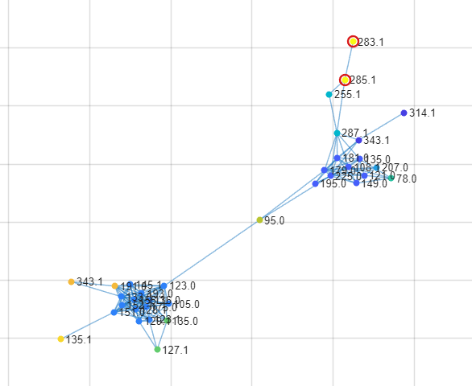{ width="480px" } | 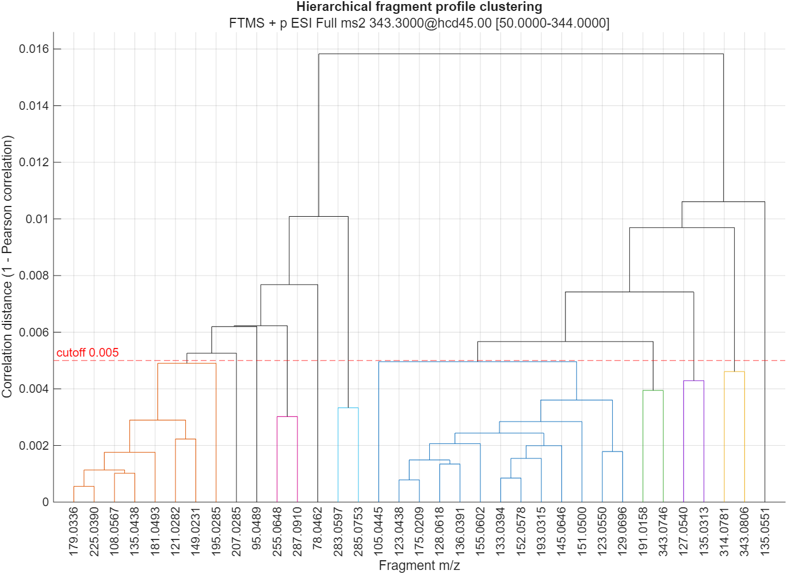{ width="480px" } |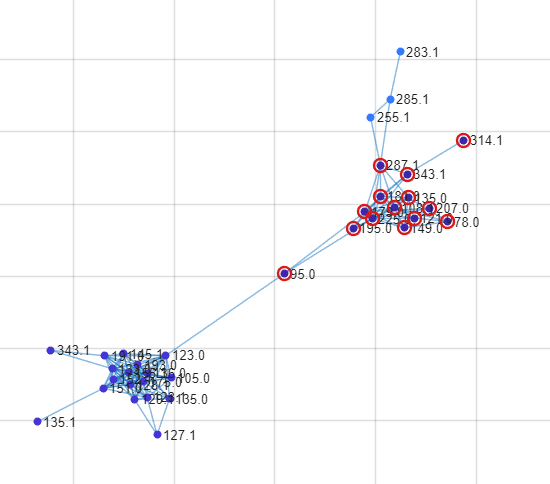{ width="480px" } |

/// caption
Differences betweenween hierarchical clustering and Louvain community detection. The hierarchical clustering splits the network into many subgroups, while Louvain is more conservative, and splits the network into three communities.
///

If the two methods disagree, treat the result as exploratory. In that case, inspect the profile plot and use **Manual brushing** to test the fragment set that looks most chemically plausible.

#### 5. Confirm with proxy-based deconvolution

If the fragment network suggests two candidate groups, select representative proxy ions manually and run **Stepped MS/MS Deconvolution**. For the difficult 342/343 case, this step is especially useful because it tests whether a selected proxy produces a reconstructed spectrum that can stand on its own.

From the article's supplementary information, the m/z values of 342A and 342B are `343.0747` and `343.0812`, respectively. In the fragment network, these closely spaced ions separate into their own groups.

| 342A and 342B Clearly separated | Deconvolution of 342A | Deconvolution of 342B |
|---|---|---|
| 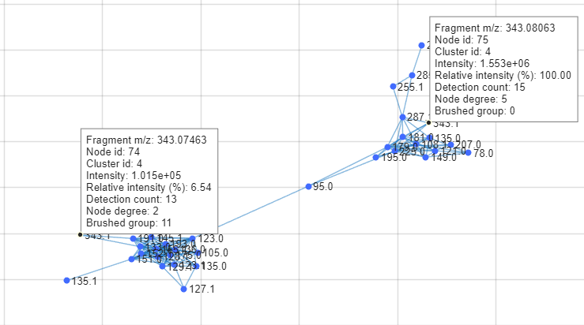{ width="480px" } | 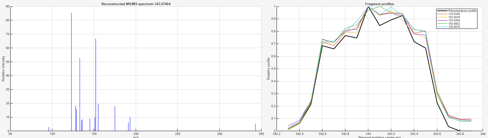{ width="480px" } | 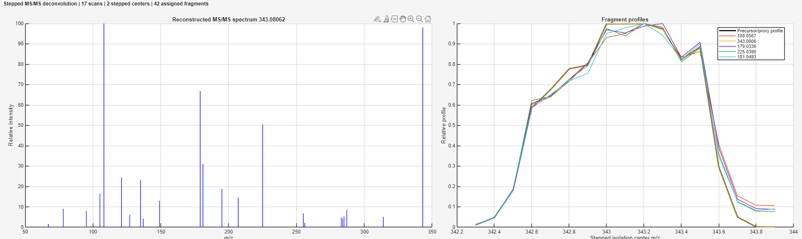{ width="480px" } |

/// caption
The 342A/342B example is a difficult chimeric case because the two ions differ by only `0.0065` m/z. The fragment network separates the two correlated fragment groups, and proxy-based stepped deconvolution reconstructs spectra consistent with the two known isobaric compounds.
///

This is the strongest form of evidence in this workflow: the fragment profiles separate in the network, the selected proxy ions reconstruct different spectra, and the reconstructed spectra can be compared against the expected reference compounds. For this example, the result should be interpreted as successful deconvolution when the two reconstructed spectra remain distinct and their fragment patterns agree with the expected 342A and 342B spectra.

!!! note
    Unfortunately, the spectras of 342A and 342B does not exist in any of the MS/MS databases provided, and the authors of the paper does not provide them either.

#### Final conclusion

Together, the 180 and 342/343 examples provide useful demonstration cases for the MS/MS workflow. The 180 example shows a more straightforward case where correlated fragments can be grouped, reconstructed, and compared with the expected compound. The 342/343 example is a harder case where two nearly isobaric ions show separable stepped intensity profiles in this dataset, even though the raw MS/MS spectra are chimeric.

These examples suggest that DIP_IT can be used as an exploratory tool for stepped MS/MS data, including cases where chimeric spectra need to be separated before interpretation. For unknown samples, the output should be treated as supporting evidence for annotation rather than automatic identification. The method should be checked with standards, reference spectra, expected chemistry, and additional validation before making strong biological or chemical claims.


### Suggested MS/MS workflow

A typical MS/MS inspection workflow is:

1. Load the raw or mzML file.
2. Open the MS/MS spectrum viewer.
3. Select the relevant scan filter.
4. Scroll through scans and inspect the spectrum quality.
5. Adjust the average tolerance if repeated scans should be averaged.
6. Drag across the TIC plot or press **Average Spectrum** to create an averaged spectra of the whole scan filter.
7. Press **Search Database**.
8. Check precursor error, cosine score, matched fragment count, and the mirror plot.
9. If the spectrum appears chimeric, inspect the fragment network to find related fragment groups or possible proxy ions.
10. Run stepped deconvolution when suitable stepped scan filters are available.
11. Copy or export the spectrum, group, deconvoluted spectrum, or results table if needed.

For clean compound annotation, use the database result together with precursor accuracy, fragment matches, expected ion mode, sample context, and known chemistry.

### Export MS2 Evidence

The **Export MS2 Evidence** button is located in the MS/MS Annotation panel below the **Spectrum Viewer** button. It is separate from the export buttons inside the spectrum viewer.

This tool searches the loaded MS/MS scan filters for user-defined diagnostic fragment ions and neutral losses, then exports the evidence as a .csv file. It is useful when you want to check whether specific fragment ions or neutral losses are consistently present across MS/MS scan filters.

Before pressing **Export MS2 Evidence**, enter the expected values in the MS/MS Annotation panel:

| Input | Description |
|---|---|
| Fragment list | Comma-separated diagnostic fragment m/z values to search for directly in the MS/MS spectra |
| Neutral loss list | Comma-separated neutral losses to search for relative to each scan filter precursor m/z |
| m/z tolerance | Maximum allowed distance between the expected fragment/neutral-loss m/z and an observed MS/MS peak |
| Precursor tolerance | Groups nearby scan-filter precursor m/z values before summarizing the evidence |
| Minimum mean intensity | Removes weak evidence rows below the selected average intensity threshold |
| Minimum scans | Removes rows with too few MS/MS scans contributing evidence |

The output table is saved as a semicolon-delimited .csv file. By default, the suggested filename is:

```text
ms2_hits.csv
```

The exported table summarizes each precursor or scan-filter group and contains columns such as:

| Column | Description |
|---|---|
| `precursorMz` | Precursor m/z extracted from the MS/MS scan filter |
| `filterName` | Scan filter name or grouped scan filter names |
| `nScans` | Number of MS/MS scans contributing to that row |
| `frag_<mz>` | Mean intensity of the selected diagnostic fragment ion |
| `nl_<mz>` | Mean intensity of the selected neutral-loss-derived fragment ion |

Nested per-scan evidence columns are removed before export because they do not paste cleanly into ordinary spreadsheet software.

!!! note
    **Export MS2 Evidence** is a targeted evidence export. It does not perform library database matching and does not export the currently plotted spectrum. For library matches, use **Search Database** inside the spectrum viewer. For the currently displayed spectrum, use **Copy Spectrum** or **Export Spectrum** inside the spectrum viewer.
