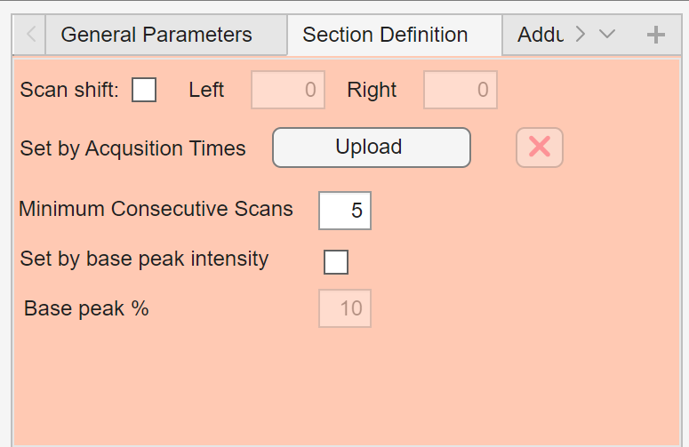

# Section definition

The **Section Definition** panel controls how DIP_IT identifies sections in continuous acquisition data.

{ width="500px" }

Sections are scan ranges that represent meaningful parts of a continuous file, such as individual sample regions, injections, blanks, or QC sections.

These section definitions are used throughout the application for feature extraction, filtering, plotting, export, adduct search, isotopologue detection, and data analysis.

## Parameter overview

| Parameter | Description |
|---|---|
| Scan shift | Enables manual adjustment of detected section boundaries |
| Left | Number of scans to shift or crop on the left side of the section |
| Right | Number of scans to shift or crop on the right side of the section |
| Set by Acquisition Times | Upload acquisition-time information for defining sections |
| Minimum Consecutive Scans | Minimum number of consecutive scans required to create a section |
| Set by base peak intensity | Detect sections using base peak/TIC intensity instead of acquisition time |
| Base peak % | Percentage threshold used for base peak/TIC-based section detection |

## Scan shift

The **Scan shift** option allows manual adjustment of detected section boundaries.

When enabled, DIP_IT can crop or shift detected sections around their center point using the **Left** and **Right** values.

This can be useful if automatic section detection includes too much background before or after the true section.

## Left and Right

The **Left** and **Right** fields define how many scans should be kept or shifted relative to the detected section center when scan shifting is enabled.

For example, if a section is detected but contains too many scans before or after the main signal region, scan shifting can be used to focus the section on the most relevant scan range.

If **Scan shift** is disabled, these values are ignored.

## Set by Acquisition Times

The **Set by Acquisition Times** option allows sections to be defined using acquisition time. 

When this method is used, DIP_IT detects sections by identifying scan ranges that are within the acquisition-times for each section. Scans outside the retention time ranges are ignored for analysis.

The input is a `.CSV` or `.xlsx` file, where each row is a section and column one and two are the start and end acqusition times of the section.

The example below shows how to define three sections:

| Start time | End time |
|---|---|
| 0.0 | 5.0 |
| 5.1 | 7.5 |
| 11.0 | 15.0 |

## Minimum Consecutive Scans

The **Minimum Consecutive Scans** value defines the minimum length required for a detected section.

Shorter scan runs are ignored.

This helps prevent small noise spikes or isolated scans from being detected as real sections.

Example: if `Minimum Consecutive Scans = 5`, a detected region must contain at least 5 consecutive scans to be accepted as a section.

## Set by base peak intensity

The **Set by base peak intensity** option switches section detection from injection-time-based detection to intensity-based detection.

When enabled, DIP_IT detects sections using the base peak of the TIC intensity trace. This can be useful if some datasets have a constant injection time across the whole experiment.

!!! note
    To detect sections by base peak intensity, the option **must be enabled** while creating and loading the log file. Otherwise the sections in the log file will be created and loaded with respect to the injection time.

## Base peak %

The **Base peak %** field defines the threshold used for determining what constitutes a section.

The value is interpreted as a percentage of the maximum intensity in the TIC intensity trace.

Example: if `Base peak % = 10`, DIP_IT identifies section scans where the intensity trace is above 10% of its maximum value.
