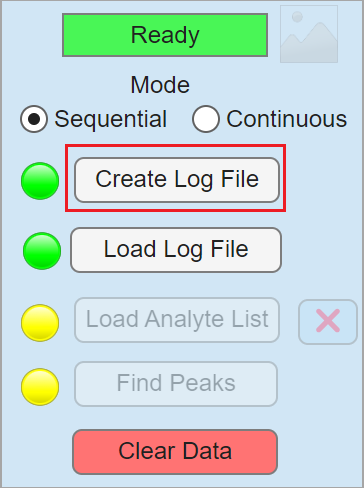
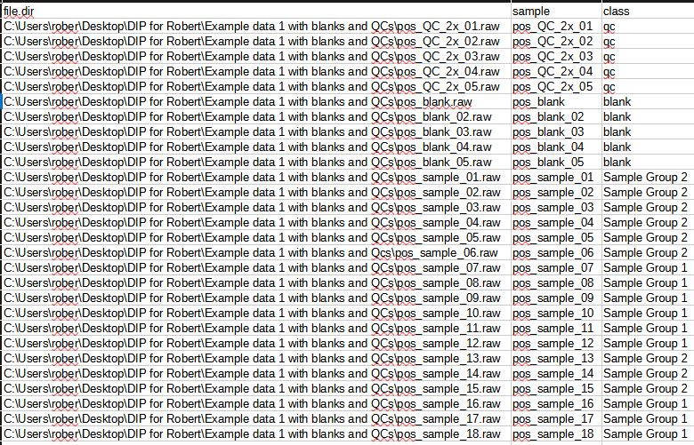

# Creating a log file

To create a log file, open the **Create log file** button in and select a folder containing either `.RAW` or `.mzML` files.

{ width="200px" }

The log file tells DIP_IT which files should be loaded and how they should be interpreted. Each entry should describe:

| Column | Description |
|---|---|
| `file_dir` | Full path to the `.mzML` or `.RAW` file |
| `sample` | Sample name used in plots, dropdowns, and exports |
| `class` | Class label, such as `sample`, `blank`, or `qc` |

The application automatically fills the `file_dir` and `sample` entries based on the file path and file name.

For sequential experiments, each row usually corresponds to one file. For continuous experiments, one file can contain several sections. In that case, DIP_IT can detect the sections based on their injection time and expand the log file information so each detected section receives a sample name and class row.

Common class labels are:

| Class | Meaning |
|---|---|
| `sample` | Biological or experimental sample |
| `blank` | Blank/background acquisition used for blank filtering or subtraction |
| `qc` | Quality-control sample used for QC CV filtering and reproducibility checks |

Class labels are important because many filters use them differently. For example, blank filters use rows labelled `blank`, and QC CV filtering uses rows labelled `qc`. Any class name that's not not QC or blank will be considered as a sample. Grouping samples under the same class name allows for statistical analysis such as ANOVA between different groups.

Once a log file has been created, it will be automatically opened using the default software installed for reading .CSV or .xslx files. Lastly, you need to annotate the classes different sections or files manually. An example log file is shown below:

{ width="1000px" }