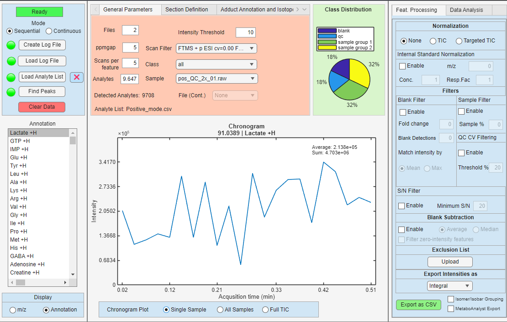

# Your first experiment

This page describes the basic workflow for loading a new experiment into DIP_IT. An experiment usually consists of mass spectrometry data files, a log file describing the samples, and an optional analyte list.

## What you need

The application supports `.mzML` and Thermofisher `.RAW` files, collected either in sequence or in continuous mode. 

For either of these modes, the application requires a log file in the `.CSV` or `.xsls` that specifies which files to load, and the class label for each section/file, such as sample, blank or QC. 

For tageted analysis, an analyte list is needed where the first column is the m/z of interest, and the second column is its corresponding annotation. 

## Creating a log file

To create a log file, open the **Create log file** button in and select a folder containing either `.RAW` or `.mzML` files.

{ width="200px" }

The log file tells DIP_IT which files should be loaded and how they should be interpreted. Each entry should describe:

| Column | Description |
|---|---|
| `file_dir` | Full path to the `.mzML` or `.RAW` file |
| `sample` | Sample name used in plots, dropdowns, and exports |
| `class` | Class label, such as `sample`, `blank`, or `qc` |

The application automatically fills the `file_dir` and `sample` entries based on the file path and file name.

For sequential experiments, each row usually corresponds to one file. For continuous experiments, one file can contain several sections. In that case, DIP_IT can detect the sections based on their injection time and expand the log file information so each detected section receives a sample name and class row.

Common class labels are:

| Class | Meaning |
|---|---|
| `sample` | Biological or experimental sample |
| `blank` | Blank/background acquisition used for blank filtering or subtraction |
| `qc` | Quality-control sample used for QC CV filtering and reproducibility checks |

Class labels are important because many filters use them differently. For example, blank filters use rows labelled `blank`, and QC CV filtering uses rows labelled `qc`. Any class name that's not not QC or blank will be considered as a sample. Grouping samples under the same class name allows for statistical analysis such as ANOVA between different groups.

Once a log file has been created, it will be automatically opened using the default software installed for reading .CSV or .xslx files. Lastly, you need to annotate the classes different sections or files manually. An example log file is shown below:

{ width="1000px" }

## Creating an analyte list for targeted mode (optional)

The application supports both untargeted mode for exploratory analysis, and targeted mode for a select m/z. To run the application in targeted mode, an analyte list containing m/z and their annotation needs to be provided in the form of a `.CSV` or `.xlsx`. Each row should contain a m/z of interest, and its corresponding annotation as two separate columns. 

The table below shows how the structure of the analyte list should look like.

| m/z | Annotation |
|---|---|
| 90.038971 | Lactate +H |
| 192.034281 | Citrate +H |
| 133.044785 | Asp +H |
| ...        | ...     |

## Loading an experiment

After creating an log file and an optional analyte list, you should now be able to load the data into the application. To do so, first select in which mode the dataset has been collected (Sequential or Continuous), and press **Load Log File** to select the log file.  

### Sequential experiments

Use sequential mode when each file represents one sample, blank, or QC acquisition.

In sequential mode, the log file usually contains one row per file. DIP_IT loads each file as a separate sample entry and uses the `class` column to decide how that file should be used during filtering and analysis.

Example:

| file_dir | sample | class |
|---|---|---|
| `C:\data\sample_01.mzML` | `sample_01` | `sample` |
| `C:\data\sample_02.mzML` | `sample_02` | `sample` |
| `C:\data\qc_01.mzML` | `qc_01` | `qc` |
| `C:\data\blank_01.mzML` | `blank_01` | `blank` |

Sequential mode is usually appropriate when the acquisition software saved one file per sample.

### Continuous experiments

Use continuous mode when one file contains several acquisition sections. This can occur when multiple sample injections or sample regions are acquired inside the same `.RAW` or `.mzML` file.

In continuous mode, DIP_IT detects sections and stores the scan interval for each section, instead of considering each file its own section.

## Exporting features

If everything has gone well so far, you should have successfully loaded an experiment! The application will look similar to below, displaying a chronogram and a feature list.

### Feature list

The feature list contains the m/z values currently available for filtering, visualization, export, and downstream analysis.

Depending on the workflow, the feature list can come from:

- a loaded analyte list
- detected features from the data
- filtered features after applying sample, blank, QC, S/N, or exclusion filters

When filters are applied, the feature list is updated. This means that exports and data analysis are based on the currently retained features.

### Selecting an intensity summary

Before exporting, choose how intensities should be summarized across scans or sections.

The options are:

| Summary option | Description |
|---|---|
| Integral | Sums the intensity across scans in each section |
| Average including zeros | Calculates the mean intensity including zero values |
| Average excluding zeros | Calculates the mean intensity after ignoring zero values |
| Median | Calculates the median intensity across scans |
| Signal-to-noise ratio | Exports S/N summaries instead of intensity values |

### Applying filters

DIP_IT provides several filters that can be used before export.

| Filter | Purpose |
|---|---|
| Sample filter | Keeps features detected in enough sample sections |
| Blank filter | Removes features that are too abundant in blanks |
| Blank subtraction | Subtracts blank signal from sample signal |
| QC CV filter | Removes features with poor reproducibility in QC samples |
| S/N filter | Removes features below a signal-to-noise threshold |
| Exclusion list | Removes m/z values supplied by the user |

Filters are applied to the active feature list. If a filter is disabled, the feature list is rebuilt without that filter, so removed features can appear again.

!!! note
    Blank and QC filters depend on the `class` column in the log file. Make sure blanks are labelled `blank` and QC samples are labelled `qc`.

### Choosing normalization

After filtering, choose whether the exported intensities should be normalized.

Available normalization options can include:

| Normalization | Description |
|---|---|
| None | Exports the summarized intensities directly |
| TIC normalization | Divides intensities by the total ion current |
| Targeted TIC normalization | Divides by the total signal of the targeted feature set |
| Internal standard | Divides features by a selected reference m/z |

Internal standard normalization requires an internal standard m/z value. DIP_IT finds the closest matching feature within the selected ppm tolerance and uses it as the reference signal.

### Exporting a CSV file

When the feature list, filters, intensity summary, and normalization settings are correct, press the CSV export button.

The exported file contains one row per retained m/z feature. The first columns usually describe the feature, followed by one intensity column per sample or section.

Typical columns include:

| Column | Description |
|---|---|
| `mz` | Feature m/z value |
| `annotation` | Feature name or annotation, if available |
| sample/section columns | Summarized intensity values for each sample or section |

The exact sample column names depend on the loaded log file. If sample names are available, they are used in the export.

### MetaboAnalyst export

If the MetaboAnalyst export option is enabled, DIP_IT writes the table in a format that can be imported into MetaboAnalyst.

This export includes:

- sample names
- class labels
- feature names
- intensity values

When annotations are available, they are used as feature labels. Otherwise, m/z-based labels are used.

### After export

Hopefully, you have now successfully been able to export a feature list! Also, within DIP_IT, the same filtered feature set can be used for PCA, volcano plots, ANOVA, heatmaps, correlation heatmaps, dendrograms, targeted adduct search, and isotopologue detection. See more info about this in the feature documentation page.

